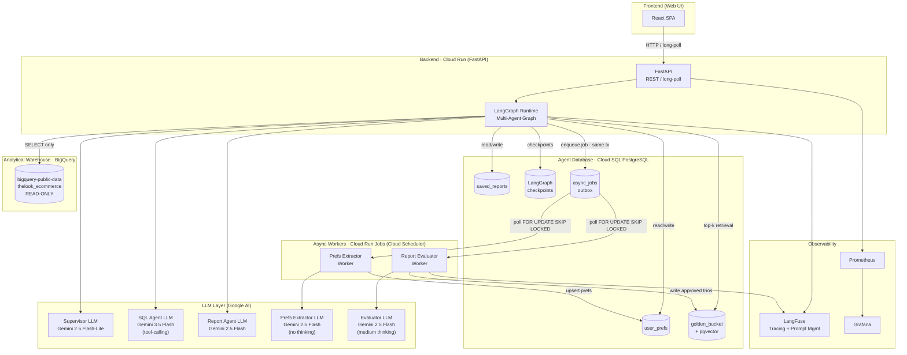
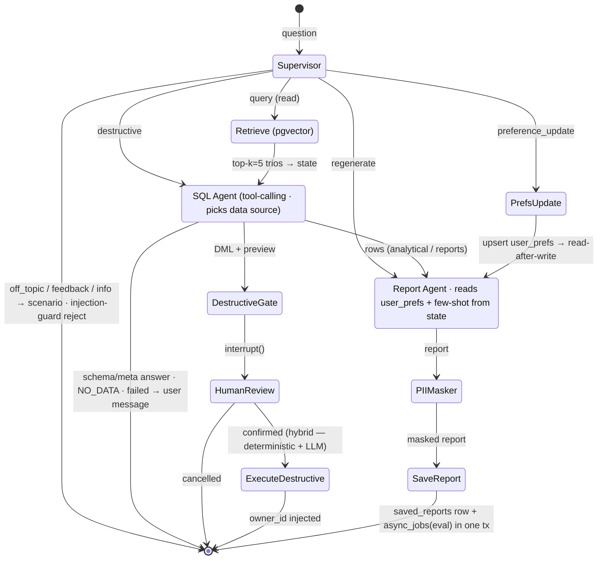
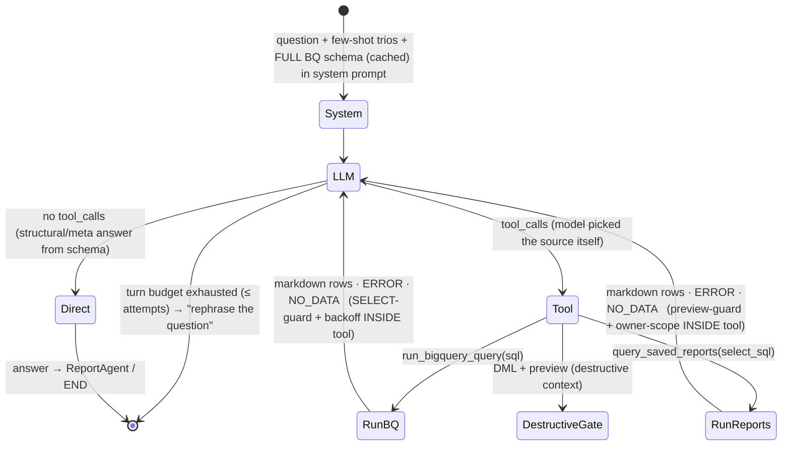
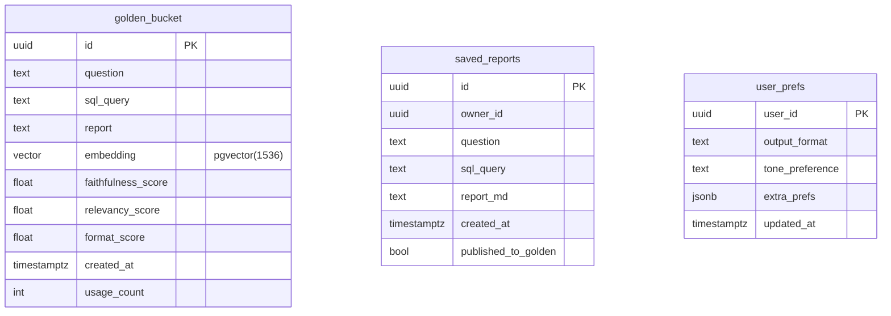

# High-Level Design: Retail Data Analysis Assistant

> Cloud provider: **GCP** · Agent database: **PostgreSQL (Cloud SQL)** · Backend: **FastAPI**

---

## Table of Contents

1. [System Overview](#1-system-overview)
2. [Architecture Diagram](#2-architecture-diagram)
3. [Building Blocks and Services](#3-building-blocks-and-services)
4. [Data Flows](#4-data-flows)
5. [Rationale for Technical Decisions](#5-rationale-for-technical-decisions)
6. [Requirements Breakdown](#6-requirements-breakdown)
7. [Error Handling and Resilience](#7-error-handling-and-resilience)
8. [Run Instructions](#8-run-instructions)

---

## 1. System Overview

The system is a chat assistant for retail company analysts and executives that delivers analytical reports over retail
data through natural language. The user asks a question in the UI, the system builds a SQL query against BigQuery,
fetches the data, generates a structured report, and saves it to a library.
The system is extensible: adding new data sources or output channels (email, charts) only requires adding new
Tool wrappers and LangGraph nodes.

**Key load characteristics:**
- DAU = 600, RPS = 0.5, RPS_peak = 2
- E[latency] ≈ 27s, p99 ≈ 103s
- E[cost] ≈ $0.030 / request, ~$10,800 / month

---

## 2. Architecture Diagram

### 2.1 Overall Architecture (components and interactions)



### 2.2 LangGraph Graph (internal agent flow)



**The Supervisor is thin** — it decides only the *flow-intent* (`query` / `destructive` / `regenerate` /
`preference_update` / `off_topic`) and cuts off injections at the entry point (injection-guard).
**The data source for `query`** (BigQuery analytics / schema structure / browsing the `saved_reports` library) is
chosen downstream by the SQL Agent itself — by calling the right tool, not by the supervisor.
The destructive gate triggers on the deterministic SQL verb (`DELETE`/`UPDATE`), not on the supervisor label —
defense-in-depth: a misclassification cannot slip a deletion past confirmation. The SQL Agent's internal
tool-calling loop is detailed in §2.3.

### 2.3 SQL Agent Internal Flow (tool-calling)



The full BQ schema is injected into the system prompt (cached per session), so the model **writes the SQL itself
as the tool argument** and **picks the source itself** (BigQuery / saved_reports), while answering a structural
question directly from the schema without a tool call. The guards (`SELECT-only` for BigQuery, `preview`/`dml` for
saved_reports) live **inside the tools** and are checked before execution.
Self-correction — a tool returns `ERROR:`/`NO_DATA:` and the model fixes the SQL within the turn budget
(`≤ attempts`). Backoff retries (`≤ 5`, `1→2→4→8→16`) are an independent budget against source unavailability:
the first budget guards against bad SQL, the second against unavailability.

### 2.4 Golden Bucket Schema (Hybrid Intelligence)



---

## 3. Building Blocks and Services

### 3.1 FastAPI Backend · Cloud Run

**Why FastAPI:**
Many long-running requests (E[latency] ≈ 27s) — an async-first framework on top of Python asyncio. No event-loop
blocking while waiting on the LLM and BQ. Cloud Run autoscales for RPS_peak = 2 (minimal instance count, no
standing cost while idle).

There is no streaming — the response is returned as a single block after PII masking. This simplifies the
protocol: a plain synchronous `POST /chat` with client-side long-polling. No WebSocket needed.

**Contracts:**
- `POST /chat` — synchronous HTTP request; the response is returned in full after PII masking
- `POST /chat/confirm` — confirm/cancel a destructive operation; resumes the interrupted graph (`resume()`). Not a
  separate REST DELETE — the destructive DML (DELETE/UPDATE) executes inside the graph after resume
- `GET /reports` — list of the user's saved reports
- `GET /health` — health check for Cloud Run

### 3.2 LangGraph Runtime

A stateful multi-agent graph. Each node (Supervisor, SQLAgent, ReportAgent) is a separate Python function that
takes and returns `AgentState`. State persistence across dialogue turns is provided by the
**LangGraph Checkpointer → PostgreSQL** (`thread_id` = the user's session ID).

Human-in-the-loop for destructive operations is implemented via `interrupt()` — the graph "freezes" at the
DestructiveGate node, waits for the user's confirmation, then resumes. We wait for the answer indefinitely.

**Extensibility:** new agents (email-sender, chart-generator) are added as graph nodes with a `conditional_edge`
from the Supervisor. A new data source is a new Tool wired into the SQLAgent.

### 3.3 LLM — Google Gemini

| Agent | Model | Rationale |
|---|---|---|
| Supervisor | `gemini-2.5-flash-lite` | Minimal latency (<1s), simple intent classification without reasoning |
| SQL Agent | `gemini-3.5-flash` (tool-calling) | Reasoning for complex JOINs/aggregations + reliable tool-calling (source selection, SQL as the tool argument); newest Flash, better than Pro on SQL benchmarks and cheaper |
| Report Agent | `gemini-2.5-flash` | The data constrains the model well, few-shot examples from the Golden Bucket give structure — no reasoning needed |
| Prefs Extractor | `gemini-2.5-flash` (no thinking) | Pure JSON extraction against a fixed schema, ~800 t/s |
| Evaluator | `gemini-2.5-flash` (medium thinking) | Light reasoning to compare report facts against SQL data; a judge error pollutes the Golden Bucket — accuracy matters |

All calls go through **LangChain `ChatGoogleGenerativeAI`** — the provider is swapped by changing a single config
parameter.

### 3.4 BigQuery · READ-ONLY Analytical Warehouse

- `bigquery-public-data.thelook_ecommerce` — the retail dataset
- SELECT-only access. At the IAM level the Cloud Run service account is granted `roles/bigquery.dataViewer`
- Cost protection: `maximum_bytes_billed` + a default `LIMIT` on every query
- PII columns (Customer Phone, Email) are masked deterministically before being returned to the user (see §6.2)

### 3.5 Cloud SQL · PostgreSQL (agent database)

A single PostgreSQL instance with the **pgvector** extension for the Golden Bucket. Five logical purposes:

| Table | Purpose |
|---|---|
| `checkpoints` (LangGraph) | Dialogue state persistence, human-in-the-loop resume |
| `saved_reports` | The user's report library, the target of destructive operations |
| `user_prefs` | Output-format preferences; read-after-write within a request |
| `golden_bucket` | question→SQL→report trios with embeddings for few-shot retrieval |
| `async_jobs` | Transactional outbox for deferred tasks (eval trios, prefs extraction); see §3.7 |

**Why PostgreSQL rather than separate stores:**
pgvector removes the need for a separate vector store (Pinecone, Qdrant). A single instance simplifies ops and the
transactionality of prefs and checkpoints. As load grows, the Golden Bucket can migrate to AlloyDB (built-in
pgvector with GPU acceleration) without code changes.

**Read-after-write preferences:** on `intent = preference_update` the Supervisor writes the new prefs to
PostgreSQL, after which — within the same HTTP request — the Report Agent reads them from the same transaction
(or with `ISOLATION LEVEL READ COMMITTED`). No cache invalidation, no eventual consistency.

### 3.6 Golden Bucket · pgvector

Stores `(question, sql, report)` trios with a vector embedding of the question (Gemini `text-embedding-004`,
1536 dim). On every new request:

1. Embed the user's question
2. `SELECT ... ORDER BY embedding <=> $1 LIMIT 5` — cosine-similarity top-k
3. The trios are fed as few-shot examples into the SQL Agent and Report Agent

Trios enter the Golden Bucket only after passing the Evaluator (faithfulness ≥ 1.0, relevancy ≥ 0.8,
format ≥ 0.75).

### 3.7 Async Workers · Postgres outbox + Cloud Run Jobs

Deferred tasks (trio evaluation, implicit-prefs extraction) are **eventual**, batched, and loss-tolerant. The
transport is the `async_jobs` outbox table in the same Postgres, with no separate queue.

**The `async_jobs` table:**

| Column | Purpose |
|---|---|
| `id` | PK |
| `type` | `eval_trio` / `prefs_extract` |
| `payload` | jsonb (`report_id` / `session_id`) |
| `status` | `pending` / `processing` / `done` / `failed` |
| `attempts` | retry counter |
| `created_at`, `processed_at`, `last_error` | tracing |

**Task enqueue happens in the same transaction as the source.** When saving a report, the `INSERT` into
`saved_reports` and the `INSERT` into `async_jobs(type='eval_trio')` are atomic — there is no dual-write problem:
either both or neither. The `prefs_extract` task is enqueued the same way at session close.

**Workers are Cloud Run Jobs on Cloud Scheduler** (e.g., every 5 min). Each claims a batch:

```sql
SELECT * FROM async_jobs
 WHERE status = 'pending' AND type = :type
 ORDER BY created_at
 FOR UPDATE SKIP LOCKED
 LIMIT :batch;
```

`SKIP LOCKED` lets multiple worker instances run in parallel without locking. After processing — `status='done'`;
on error — `attempts++`, and after `attempts > N` → `status='failed'` (acts as a DLQ, see §7.3).

- **Prefs Extractor Worker** — extracts implicit preferences from session history, upserts into `user_prefs`.
- **Report Evaluator Worker** — evaluates a trio and, on passing thresholds, writes to `golden_bucket`.

Neither affects critical-path latency.

### 3.8 LangFuse · Observability + Prompt Management

- **Tracing:** every LLM call is wrapped in a span with `input/output tokens`, `cost`, `latency`,
  `prompt_version`. Hierarchy: `session → supervisor → sql_agent → report_agent`.
- **Prompt Management:** system prompts (including the CEO prompt) are stored in LangFuse. The prompt manager
  provides a REST API + UI for editing without a deploy. LangGraph picks up the prompt by the `production` tag on
  every run.
- **Custom metrics:** `regeneration_count` per session (how many times the user requested a regeneration before
  accepting).

### 3.9 Prometheus + Grafana · System Metrics

FastAPI exposes `/metrics` (Prometheus format). Grafana dashboard:
- **Rate:** requests/sec
- **Errors:** 5xx rate, timeout rate
- **Duration:** p50/p95/p99 end-to-end (E[latency] ≈ 27s; alert at p95 > 40s)
- **FastAPI specifics:** event loop lag, active connections, DB connection pool saturation

---

## 4. Data Flows

### 4.1 Happy Path (analytical request)

```
User → FastAPI POST /chat
  → [LangGraph: Supervisor]
      ├─ classify intent = "analytical"
      └─ route → Retrieve

  → [LangGraph: Retrieve]
      ├─ embed(question) → pgvector cosine top-k=5 over golden_bucket
      ├─ trios (question, sql, report) → into state
      ├─ empty → zero-shot fallback
      └─ route → SQLAgent

  → [LangGraph: SQLAgent]
      ├─ generate SQL (few-shot trios from state)
      ├─ validate: SELECT-only guard
      ├─ run_sql → BigQuery (max_bytes_billed, LIMIT)
      ├─ mask PII columns (deterministic mapping + regex)
      └─ route → ReportAgent

  → [LangGraph: ReportAgent]
      ├─ generate report (few-shot reports from state + user_prefs)
      ├─ PII double-check (pattern matching)
      └─ save to saved_reports

  → INSERT async_jobs(eval_trio) in the same tx as saved_reports
  → return report to FastAPI → HTTP response → User
```

### 4.2 Destructive Operation

Destructive requests can be either DELETE or UPDATE (`saved_reports`), so the SQL is generated dynamically by the
agent. Safety is enforced not by forbidding generation but at the execution level.

```
User: "Delete all my reports from today" / "Rename all reports mentioning client X"

  → [Supervisor] intent = "destructive"

  → [SQLAgent] (context = saved_reports) — two steps:
      1. SELECT * FROM saved_reports WHERE <condition from request>
         (show the user what will be affected)
      2. Prepare the final DML (DELETE or UPDATE) over the same filters

  → [SQLGuard] deterministic check:
      ├─ statement ∈ {DELETE, UPDATE}?  else → reject
      ├─ target table == saved_reports?  else → reject
      ├─ DDL (DROP/ALTER/TRUNCATE/CREATE)? → reject
      └─ reject → regenerate (attempt < 3)

  → [DestructiveGate]
      ├─ run the SELECT → show the user the list of N records
      ├─ interrupt() — the graph waits
      └─ User confirms / cancels

  → resume graph
  → [ExecuteDestructive] reports_repo.execute(dml, owner_id=:current_user)
      └─ the repository forcibly appends AND owner_id = :current_user
         before execution — regardless of what the LLM generated
  → return "Changed/deleted N records"
```

**Two SQL Agent contexts → two deterministic guards:**
- **BigQuery** — SELECT only; non-SELECT is rejected before execution
- **PostgreSQL `saved_reports`** — whitelist: only `DELETE`/`UPDATE` strictly on the `saved_reports` table are
  allowed. DDL (`DROP`/`ALTER`/`TRUNCATE`/`CREATE`) and references to any other table are rejected.
    On top of that the repository **always** injects `AND owner_id = :current_user` — two independent lines: the
    guard limits the *type and target* of the operation, the repository limits the *scope* (own reports only)

### 4.3 Preference Update

```
User: "Answer me in bullet points"

  → [Supervisor] intent = "preference_update"
  → UPDATE user_prefs SET output_format = 'bullet_points' WHERE user_id = :user_id
  → read-after-write: SELECT prefs → pass to ReportAgent
  → regenerate the last report in the new format
```

### 4.4 Async: Golden Bucket Update

```
Cloud Scheduler → Evaluator Worker (Cloud Run Job)
  ├─ claim batch: SELECT ... WHERE status='pending' AND type='eval_trio'
  │              FOR UPDATE SKIP LOCKED
  ├─ for each task:
  │   ├─ load trio (question, sql, report) by report_id
  │   ├─ load top-k similar trios from golden_bucket
  │   ├─ LLM judge: faithfulness / relevancy / format_adherence
  │   ├─ if all scores ≥ thresholds:
  │   │     embed(question) → INSERT INTO golden_bucket
  │   └─ status='done' (or attempts++ / 'failed' on error)
  └─ emit metrics to LangFuse
```

---

## 5. Rationale for Technical Decisions

### Why LangGraph rather than direct LLM calls

LangGraph provides: (a) a stateful graph with persistence via the PostgreSQL checkpointer — required for
human-in-the-loop in the destructive flow and for multi-turn dialogue; (b) `interrupt()/resume()` — a standard
mechanism for awaiting confirmation without a hand-written FSM; (c) conditional edges — declarative routing
between agents, extensible without refactoring.

### Why pgvector rather than a separate vector store

At RPS = 0.5 and k=5 the vector-search load is minimal. pgvector on Cloud SQL covers it without the operational
overhead of a separate service (Pinecone, Weaviate). As it grows — AlloyDB with built-in pgvector (no schema
migration).

### Why Cloud Run rather than GKE

RPS_peak = 2 is not a load that requires a permanently running cluster. Cloud Run: scale-to-zero off-hours,
autoscaling for the peak, no overhead of pod management.

### Why a Postgres outbox rather than a separate queue (Pub/Sub)

The tasks are eventual, batched, and low-frequency (~12k/day) — a dedicated queue is overkill. Most importantly:
the outbox solves the **dual-write problem**. With an external queue, saving the report and publishing the eval
event are two different systems that cannot be made atomic; a publish failure → the trio is silently lost. In
Postgres the report `INSERT` and the task `INSERT` go in one transaction — a stronger delivery guarantee than a
broker's at-least-once.
Plus we already run Postgres: zero new infrastructure surface (topics, subscriptions, IAM).
`FOR UPDATE SKIP LOCKED` gives concurrent workers, `status='failed'` serves as a DLQ. The downside is no push
latency, but for eventual tasks that is irrelevant.

---

## 6. Requirements Breakdown

### 6.1 Hybrid Intelligence (Golden Bucket)

**Problem:** without context, the SQL agent can build technically correct but analytically wrong queries (wrong
granularity, wrong filters).

**Solution:** the Golden Bucket — a vector database of `(question, sql, report)` trios. On every request:
- top-k by cosine similarity are fed to the SQL Agent as few-shot examples → the agent grasps the analytical logic
  of previous queries
- top-k reports are fed to the Report Agent → the agent sees the expected structure

**Update:** the Evaluator Worker asynchronously scores each accepted trio on 5 metrics (faithfulness, relevancy,
format, context_recall, context_precision). Trios that clear the thresholds are added to the Golden Bucket.

**Zero-shot fallback:** if top-k is empty (no similar questions), the agent works without few-shot, using only the
system prompt and the DB schema.

**Future work:** deduplication (block adding a trio if its embedding is too close to an existing one); periodic
cleanup of stale trios; monitoring the average score of accepted trios.

### 6.2 Safety & PII Masking

**Problem:** BigQuery may return Customer Phone, Email in the SQL results.

**Solution — two-level deterministic masking:**

1. **Column mapping** — a static registry of PII columns in `config.py`:
   ```python
   PII_COLUMNS = {"customers.email", "customers.phone", "orders.shipping_address"}
   ```
   After fetching the DataFrame from BigQuery, all values in PII columns are replaced with `***MASKED***` before
   being passed to the Report Agent. If the DB schema changes, the registry is updated in code (a single point of
   change).

2. **Pattern-matching fallback** — regular expressions on the final report text:
   ```python
   EMAIL_RE = r'[a-zA-Z0-9._%+-]+@[a-zA-Z0-9.-]+\.[a-zA-Z]{2,}'
   PHONE_RE = r'\+?[\d\s\-\(\)]{10,15}'
   ```
   Any match is replaced with `[REDACTED]`.

3. **Streaming disabled** — the response is returned only after fully passing both masking levels.

**Off-topic protection:** the Supervisor classifies off-topic questions as `off_topic` and returns a message to
the user without any internal processing.

### 6.3 High-Stakes Oversight (Destructive Ops)

**Problem:** "Delete all reports mentioning client X" is an irreversible operation.

**Solution:**

0. **Input injection-guard** (deterministic, in the Supervisor): before the SQL agent, explicit SQL injections
   (`; DROP`, `--`, `UNION SELECT`), prompt injections in English (e.g. "ignore your rules"), and
   references to foreign (BigQuery) tables in a destructive request are cut off → rejected with a warning.
1. The Supervisor detects `intent = destructive` at the classification level
2. The SQL Agent (context = `saved_reports`) generates two artifacts (structured `PREVIEW:`/`ACTION:` output):
   - a `SELECT` for the preview of affected records
   - the final DML (`DELETE` or `UPDATE`) — the type depends on the user's request
3. **The DML-guard** (deterministic, not LLM) checks the generated statement: only `DELETE`/`UPDATE`, only on the
   `saved_reports` table; any DDL (`DROP`/`ALTER`/`TRUNCATE`/`CREATE`), a second statement/`;`/comment, or another
   table — reject + regeneration (up to 3 attempts). This mirrors the SELECT-only guard for BigQuery
4. The `DestructiveGate` node runs the owner-scoped SELECT, shows the user the list of N records, and calls
   `interrupt()` — the graph waits. An empty preview (0 rows) → the answer "no report matched the condition",
   without `interrupt()`
5. **Hybrid confirmation:** explicit "yes"/"no" are handled by a deterministic floor, anything ambiguous goes to
   the LLM, **biased toward "not confirmed"** (an LLM error/unavailability → not confirmed — we never delete on
   doubt). For `UPDATE` — pick a specific row from the list (cancel / all / number)
6. On confirmation: `reports_repo.execute(dml, owner_id=:current_user)` — the repository forcibly appends
   `AND owner_id = :current_user` before execution, regardless of what the LLM generated
7. Affecting someone else's data is impossible: `owner_id` is injected in code, never passed from the LLM

**Three independent lines of defense:** (1) the input-guard cuts off injections at the entry; (2) the DML-guard
limits the *type and target* of the operation (no DDL, no foreign table); (3) the repository limits the *scope*
(own reports only). Even with a successful prompt injection, none of them can be bypassed through the LLM. Plus a
fourth layer: the gate triggers on the deterministic SQL verb, not on the supervisor label.

> **Implementation lesson:** owner-scoping must be done via a **parameterized WHERE rewrite** (with correct
> parenthesized grouping of existing conditions, before `ORDER BY/LIMIT`), not via naive concatenation
> `... AND owner_id = ?` — otherwise `WHERE a OR b` weakens the scoping. In the prototype this is recorded as open
> technical debt.

### 6.4 Continuous Improvement (Learning Loop)

**User Level:**

- **Explicit:** `intent = preference_update` → the Supervisor writes prefs to `user_prefs` → read-after-write
  passes them to the Report Agent for immediate application.
- **Implicit:** at session close, a `prefs_extract` task is enqueued in `async_jobs`. The Prefs Extractor Worker
  (Cloud Run Job) later analyzes the dialogue history, extracts implicit preferences (tone, format, level of
  detail), and upserts them into `user_prefs`. It does not block the critical path.

**System Level:**

The Report Evaluator Worker scores each accepted trio. Approved trios enter the Golden Bucket and improve the
few-shot quality for all users.

### 6.5 Resilience & Graceful Error Handling

| Situation | Behavior |
|---|---|
| SQL syntax error | Regenerate with the error in context, up to 3 attempts |
| SQL ran, returned 0 rows | The tool returns `NO_DATA` → the model may broaden the filters (softly, within the turn budget); otherwise "No data for your query" |
| SQL turn budget exhausted | "Could not build the query, please rephrase" |
| BigQuery unavailable | 5 retries with exponential backoff (1s→2s→4s→8s→16s) |
| Gemini 429 / quota / overload | Fail-fast (no app retries, SDK retries disabled): "The model is temporarily unavailable (rate limit exceeded)" (`LLM_UNAVAILABLE`) |
| Gemini 5xx / transient model unavailability | Fail-fast (no app retries): "Service temporarily unavailable, try again later" (`SERVICE_UNAVAILABLE`) |
| top-k in the Golden Bucket is empty | Zero-shot (prompt without few-shot examples) |
| 3rd-party API errors | Logged to LangFuse + Prometheus alert, manual remediation |

All errors are logged with a retry counter. The user gets clear messages, no stack trace.

### 6.6 Quality Assurance

The CI pipeline (Cloud Build) runs the tests on every PR:

**Unit tests (pytest):**
- Deterministic destructive-operation detector
- Repository owner-scope predicate
- SELECT-only guardrail + LIMIT enforcement
- PII masking (column mapping + pattern)
- Retry/self-correction counters

**Eval tests (DeepEval):**

| Metric | Target | Tool |
|---|---|---|
| Context Precision | ≥ 0.7 | DeepEval `ContextualPrecisionMetric` |
| Context Recall | ≥ 0.8 | DeepEval `ContextualRecallMetric` |
| Faithfulness | = 1.0 | DeepEval `FaithfulnessMetric` (zero tolerance for hallucinations in financial data) |
| Answer Relevancy | ≥ 0.8 | DeepEval `AnswerRelevancyMetric` |
| Format Adherence | ≥ 0.75 | DeepEval + a custom prompt judge |

The tests run against a golden dataset (questions + reference trios) prepared by analysts. They do not block the
deploy (advisory threshold) but alert on degradation.

### 6.7 Observability

**LangFuse (LLM metrics):**
- A span per LLM call: tokens, cost, latency, prompt_version
- Span hierarchy: `session → supervisor → sql_agent → report_agent`
- Custom metric `regeneration_count` per session
- Errors: LLM API errors (with retry counter), SQL syntax errors, SQL execution errors, third-party API errors
- Prompt versioning: correlate quality degradation with CEO-prompt updates

**Prometheus + Grafana (system metrics — RED):**
- **Rate:** requests/sec on FastAPI endpoints
- **Errors:** 5xx rate, timeout rate
- **Duration:** p50/p95/p99 end-to-end latency (alert: p95 > 40s)
- **FastAPI specifics:** event loop lag (alert: > 100ms), active connections, DB pool saturation

**Debugging flow:** during an incident, the LangFuse trace by `session_id` shows the full conversation, all LLM
calls with context, and the cost and latency of each step. Grafana shows the system context at the moment of the
incident.

### 6.8 Agility (Persona Management)

**Problem:** the CEO wants to change the report tone weekly without a deploy.

**Solution:** system prompts (including the CEO prompt for the Report Agent) are stored in **LangFuse Prompt
Management**. On every run, LangGraph fetches the prompt by the `production` tag via the LangFuse SDK:

```python
prompt = langfuse.get_prompt("report_agent_system", label="production")
```

The LangFuse UI provides a no-code editor + versioning + instant rollback to a previous version. Prompt-editing
rights are via LangFuse RBAC (CEO / product only).

**Audit:** every call logs `prompt_version` → in LangFuse you can see when and how the tone changed, and how it
affected the metrics.

---

## 7. Error Handling and Resilience

### 7.1 Retry Policy

```
SQL generation errors (invalid SQL / wrong fields):
  max_attempts = 3
  strategy = immediate retry with error in context
  on_exhaust = "Could not build the query, please rephrase the question"

Database / BigQuery unavailable:
  max_attempts = 5
  strategy = exponential backoff (1s, 2s, 4s, 8s, 16s)
  on_exhaust = "Service temporarily unavailable, try again later"

LLM quota / 429 / overload:
  max_attempts = 1 (no app retry; SDK retries disabled, per-request timeout)
  on_error = "The model is temporarily unavailable (rate limit exceeded)" (LLM_UNAVAILABLE)

LLM transient 5xx / unavailable:
  max_attempts = 1 (no app retry — fail-fast)
  on_error = "Service temporarily unavailable, try again later" (SERVICE_UNAVAILABLE)

Third-party API errors:
  Logged to LangFuse + Prometheus alert
  User: a clear error message
```

### 7.2 Circuit Breaker (Future Work)

On prolonged unavailability of BigQuery or Gemini, a Circuit Breaker puts the system into a "degraded" mode: the
Supervisor immediately returns an error message without attempting to call the unavailable service.

### 7.3 Failed jobs

Tasks in `async_jobs` that the worker fails to process after N retries are moved to `status='failed'` with
`last_error`. That is the DLQ — a plain `SELECT ... WHERE status='failed'` for manual triage, with no separate
service. Losing a task does not affect the user (eventual), but it is metered (alert on a rising `failed` count).

---

## 8. Run Instructions

### 8.1 Prerequisites

- GCP project with the APIs enabled: BigQuery, Cloud Run, Cloud SQL, Cloud Scheduler, Secret Manager
- A service account with roles: `bigquery.dataViewer`, `cloudsql.client`, `run.invoker` (for Cloud Scheduler →
  Cloud Run Jobs)
- LangFuse instance (cloud or self-hosted)
- Python 3.11+

### 8.2 Local Run (prototype)

```bash
# 1. Clone the repository
git clone <repo>
cd retail-data-analysis-assistant

# 2. Install dependencies
pip install -e .

# 3. Configure environment variables
cp .env.example .env
# Fill in:
#   GOOGLE_API_KEY=...
#   GCP_PROJECT=...
#   DATABASE_URL=postgresql://...
#   LANGFUSE_PUBLIC_KEY=...
#   LANGFUSE_SECRET_KEY=...
#   LANGFUSE_HOST=https://cloud.langfuse.com

# 4. Initialize the DB (create tables)
python -m retail_assistant.store.db

# 5. Start the CLI prototype
retail-assistant
```

### 8.3 Example Dialogue

```
> Show the top 10 products by revenue for the last month

[The system determines intent: analytical]
[SQL Agent generates a BigQuery query...]
[Report Agent builds the report...]

📊 Top 10 products by revenue (June 2026)

| Rank | Product          | Revenue      |
|------|------------------|--------------|
| 1    | Running Shoes XL | $142,300     |
| 2    | Sport Jacket M   | $98,750      |
...

> Now show the same thing as a bullet list

[intent: preference_update + regenerate]
[Prefs updated: output_format = bullet_points]

• Running Shoes XL — $142,300
• Sport Jacket M — $98,750
...

> Delete all my reports from today

[intent: destructive]
⚠️  The following 3 reports will be deleted:
  - "Top 10 products by revenue" (14:32)
  - "Returns analysis" (11:15)
  - "Regional summary" (09:44)

Confirm deletion? (yes/no): yes
✓ Deleted 3 reports.
```

### 8.4 Deploy to GCP

```bash
# Cloud Run deploy of FastAPI
gcloud run deploy retail-assistant \
  --source . \
  --region us-central1 \
  --set-env-vars GOOGLE_API_KEY=$(gcloud secrets versions access latest --secret=gemini-key) \
  --service-account retail-assistant-sa@PROJECT.iam.gserviceaccount.com \
  --min-instances 1 \
  --max-instances 10

# Async workers — Cloud Run Jobs, polling async_jobs (outbox)
gcloud run jobs create evaluator-worker \
  --image gcr.io/PROJECT/evaluator-worker \
  --region us-central1

# Scheduled run (every 5 min) — Cloud Scheduler triggers the Job
gcloud scheduler jobs create http evaluator-tick \
  --location us-central1 \
  --schedule "*/5 * * * *" \
  --uri "https://run.googleapis.com/v2/projects/PROJECT/locations/us-central1/jobs/evaluator-worker:run" \
  --http-method POST \
  --oauth-service-account-email retail-assistant-sa@PROJECT.iam.gserviceaccount.com
```

---

## Service Summary Table

| Component | GCP service / Tool | Rationale |
|---|---|---|
| Backend | Cloud Run (FastAPI) | Async, scale-to-zero, cheap at RPS ≤ 2 |
| Multi-agent orchestration | LangGraph | Stateful graph, human-in-the-loop, extensibility |
| LLM | Google Gemini (via LangChain) | Native GCP integration, different models for different tasks |
| Analytical warehouse | BigQuery | Managed, READ-ONLY, cost guardrails |
| Agent DB | Cloud SQL PostgreSQL + pgvector | Checkpoints + prefs + Golden Bucket + outbox in one instance |
| Async workers | Cloud Run Jobs + Cloud Scheduler | Poll the `async_jobs` outbox; transactional task enqueue, no latency impact |
| Observability (LLM) | LangFuse | LLM tracing + prompt management (CEO use case) |
| Observability (system) | Prometheus + Grafana | RED metrics, event loop lag, DB pool |
| CI/CD | Cloud Build | Tests + deploy |
| Secrets | Secret Manager | GOOGLE_API_KEY, DB credentials |