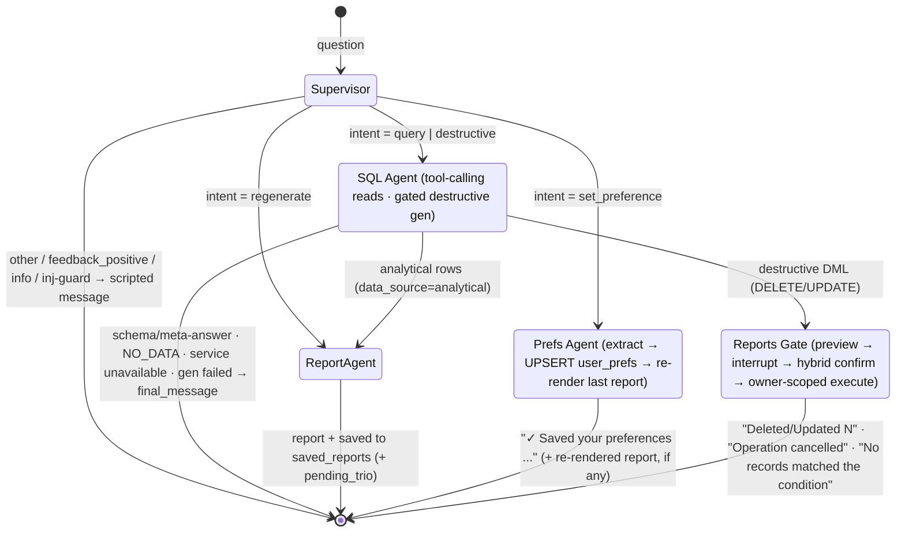
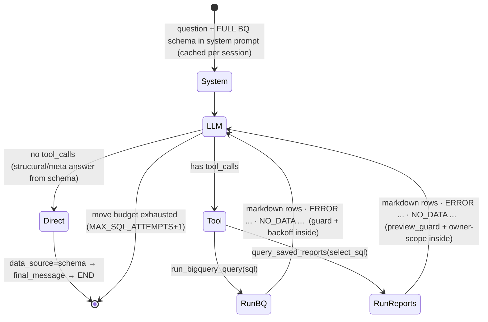

# Prototype: Retail Data Analysis Assistant (implementation)

> This document describes the **actually implemented prototype** and is kept in sync with the code.
> Extracted from [HLD.md](HLD.md): the prototype is a "local slice" of the cloud architecture (without Cloud Run,
> Cloud SQL, pgvector, async workers, and UI).
>
> Stack: **Python 3.11+ · LangGraph · LangChain (`langchain-google-genai`) · Google Gemini
> (2.5-flash-lite / 3.5-flash / 2.5-flash) · BigQuery (read-only) · SQLite · Arize Phoenix
> (opt. tracing) · DeepEval (eval tests) · CLI**.

---

## 0. Summary in 30 seconds

A chat agent in CLI. The user asks a question in natural language → LangGraph graph:

1. **Supervisor** (thin) classifies the *flow*: `query` (reading data/schema/library) ·
   `destructive` (deleting/modifying reports) · `regenerate` (editing a previous report) ·
   `set_preference` (remembering a standing report preference) ·
   `feedback_positive` / `info` / `other` (immediate scripted response).
2. **SQL Agent** for `query` — a **tool-calling agent**: BigQuery schema is embedded in the system prompt,
   the model selects the source itself by calling a tool (`run_bigquery_query` for analytics /
   `query_saved_reports` for the library) and writes SQL as a **tool argument**; answers structural
   questions directly from the schema without a tool call. Guards — inside the tools.
3. **Report Agent** generates a markdown report from the result and saves it to the local library
   (SQLite). `regenerate` edits the previous report without a new query. Reports honour the user's
   stored preferences (format/tone/extra) from `user_prefs`.
4. **Prefs Agent** for `set_preference` — extracts an explicit standing preference from the message,
   UPSERTs it into `user_prefs`, and re-renders the last shown report so the change is visible immediately
   (no new library entry, no new query).
5. For `destructive` the SQL agent generates a **PREVIEW + ACTION** (DELETE/UPDATE on `saved_reports`);
   **Reports Gate** shows a preview of affected records and **requires confirmation** (`interrupt()`),
   then executes the operation, **forcibly scoped to the owner**.
6. Everything is resilient to SQL errors/empty responses/service unavailability — **self-corrects and does not
   crash**, without inflating cost (hard budgets on regenerations and backoff; Gemini — fail-fast).

LLM calls and graph nodes can be traced in **Phoenix** (optional, `--trace` flag). **Debug mode**
(`--debug`) shows SQL/errors/tracebacks; in normal mode the user only sees **scripted messages**.

---

## 1. Prototype scope

### 1.1 Implemented requirements (selected by customer: #2 and #3)

| # | Requirement | Status |
|---|---|---|
| **High-Stakes Oversight (Destructive Ops)** | "Saved Reports" library + preview → strict confirmation (`interrupt()`) before DELETE/UPDATE, hybrid confirmation, delete only own reports | ✅ implemented |
| **Resilience & Graceful Error Handling** | SQL self-correction, empty response handling, exp-backoff on BigQuery unavailability, fail-fast on Gemini, REPL does not crash, no cost inflation | ✅ implemented |

### 1.2 Base functionality (required by assignment)

- Chat agent that **dynamically generates and executes SQL** against `bigquery-public-data.thelook_ecommerce`.
- Tables are **read live** from the dataset (`list_tables()` + `get_table_schema()`), list and columns
  are **not hardcoded**. Main ones: `orders`, `order_items`, `products`, `users` (also
  `inventory_items`, `events`, `distribution_centers`).
- Agent capabilities:
  - customer behavior (top customers, total spending);
  - product performance;
  - time-based metrics (monthly revenue, revenue by product "as of today");
  - questions about **DB structure** (which tables/columns/types) — answered from embedded schema, without querying BigQuery;
  - **browsing the library** of saved reports (list / search / view).
- Simple **CLI** interface.
- Runs on another machine by following instructions (Docker not required).
- One of the **new Gemini** models (SQL agent — `gemini-3.5-flash`).

### 1.3 Additionally implemented (beyond minimum scope)

- **`regenerate`** — editing a previous report ("make it shorter", "as a list") without a new query
  to BigQuery: the previous report and its data are read from state (the session shares a single thread checkpointer).
- **Hybrid confirmation** for destructive ops: deterministic yes/no floor + LLM only for ambiguous
  replies, biased toward "not confirmed".
- **Injection guard on input** (supervisor): SQL injections (`; DROP`, `--`, `UNION SELECT`),
  prompt injections ("ignore your rules"), attempts to reference a BigQuery table in a destructive request.
- **Deferred trio capture** (`staged_trios`): a `question→sql→report` triple is written write-only only
  on a positive signal (explicit praise / user calmly continued / AFK after report).
- **`set_preference`** — explicit standing-preference capture via a dedicated **Prefs Agent**
  (`app/agents/prefs_agent.py`): extracts `{output_format, tone, extra}` from the message, UPSERTs
  `user_prefs`, and re-renders the last report. Subsequent reports apply these preferences automatically
  (synchronous slice of Learning Loop #4 — see §1.4).
- **`feedback_positive` / `info`** intents — short scripted responses without data access.

### 1.4 Out of scope (NOT implemented in prototype)

- ❌ **Golden Bucket retrieval at query-time** — SQL/Report agents work on embedded prompts + DB schema,
  without few-shot from triples. The `trios` table is defined in DDL but is not read/filled.
- ❌ **Evaluator** (LLM judge, promoting `staged_trios → trios`). Triples are only captured (write-only).
- ❌ **PII masking** (requirement #1 not selected). ⚠️ **Known limitation:** the agent may return
  email/name/address from `users`/`orders`. Conscious trade-off; a deterministic masker is described in HLD §6.2.
- ⚠️ Learning Loop as feature (#4) — **partially implemented**: the **explicit** path works in-dialog
  (`set_preference` → Prefs Agent UPSERTs `user_prefs`; Report agent reads format/tone/extra and applies
  them to every report). NOT implemented: the **implicit** path — `prefs_extractor.py`
  (`app/agents/prefs_extractor.py`) that would infer prefs from dialogue history remains a stub for a
  future async worker.
- ❌ Persona Management (#8), async workers, Pub/Sub, Cloud deploy, React UI, authentication, streaming.

### 1.5 Infrastructure (tooling, not a "closed requirement")

- ✅ **Phoenix tracing** of all LLM calls and graph nodes — **opt-in** (`--trace` / `TRACING=1`),
  launch failure is soft (tracing is infrastructure, not a requirement).
- ✅ **Debug mode** for error display (`--debug` / `DEBUG=1`).

---

## 2. Prototype architecture

### 2.1 LangGraph graph (`app/graph/build.py`)



Routing:
- `supervisor` → conditional: `query|destructive → sql_agent`, `regenerate → report_agent`,
  `set_preference → prefs_agent`, `other → END`
  (labels `feedback_positive`/`info`/inj-guard inside supervisor collapse into `other` with a ready `final_message`).
- `sql_agent` → conditional (`_route_after_sql`): if `final_message` is set → `END`; if
  `intent == destructive` → `reports_gate`; if `data_source == schema` → `END`; otherwise → `report_agent`.
- `report_agent`, `reports_gate`, `prefs_agent` → `END`.

**Defense-in-depth:** the destructive gate triggers on the **deterministic SQL verb** (`DELETE`/`UPDATE`),
not on the supervisor label — a misclassification cannot bypass the deletion confirmation.

### 2.2 SQL Agent inner loop for `query` — tool-calling (Resilience)



- **Schema** is injected into the system prompt once per session (`lru_cache` in `app/tools/schema.py`
  + transfer of `schema_text` to state), so the model almost never needs the `fetch_bq_schema` tool.
- **Guards inside tools** (deterministically, before execution): `select_only_guard` (only one
  SELECT/WITH; prohibits DML/DDL/`;`/comments), `preview_guard` (SELECT strictly on `saved_reports`).
- **Self-correction** — the tool returns `ERROR: ...`/`NO_DATA: ...`; the model fixes the SQL and
  calls the tool again **within the move budget** (`MAX_SQL_ATTEMPTS + 1`). This is the protection against
  cost inflation — the number of LLM regenerations is strictly capped.
- **Backoff** on BigQuery unavailability — inside `run_with_backoff` (`1→2→4→8→16s`, ≤ 5 retries),
  **independent budget** from regenerations.

For `destructive` the SQL agent works not as a tool-calling loop but as a **gated generator** (see §4):
outputs two lines `PREVIEW:`/`ACTION:`, validates `dml_guard`, regenerates on reject (≤ 3).

### 2.3 Project file map

```
retail-data-analysis-assistant/
├── main.py                     # entry point → app.cli:main
├── requirements.txt
├── pytest.ini                  # unit suite default = tests/
├── .env.example
├── README.md                   # quick start + eval run
├── Prototype.md / HLD.md / Eval-Dataset.md
└── app/
    ├── config.py               # env, models, limits, budgets, paths, validate_required()
    ├── llm.py                  # ChatGoogleGenerativeAI factory (lru_cache) + llm_text() normalization
    ├── retry.py                # retry_with_backoff — reusable exp-backoff decorator
    ├── errors.py               # error taxonomy, BQ/LLM classifiers, scripted messages, format_*
    ├── observability.py        # Phoenix init (opt-in, soft)
    ├── cli.py                  # REPL, --debug/--trace flags, confirmation resume loop, AFK trios
    ├── graph/
    │   ├── state.py            # AgentState (TypedDict)
    │   └── build.py            # StateGraph assembly + routers + checkpointer (SqliteSaver)
    ├── agents/                 # graph nodes (prompts live here, next to the node)
    │   ├── supervisor.py       # thin intent classification + input injection guard + trio flush
    │   ├── sql_agent.py        # tool-calling for reads · gated generation for destructive
    │   ├── report_agent.py     # report generation + saving · regenerate branch
    │   ├── reports_gate.py     # preview → interrupt → hybrid confirmation → owner-scoped execute
    │   ├── prefs_agent.py      # set_preference: extract → UPSERT user_prefs → re-render last report
    │   └── prefs_extractor.py  # stub for future async (IMPLICIT) prefs worker (NotImplemented)
    ├── tools/                  # deterministic tools — no prompts, no LLM
    │   ├── query_tools.py      # @tool run_bigquery_query / query_saved_reports / fetch_bq_schema
    │   ├── sql_tools.py        # guards (select/preview/dml/reports), run_with_backoff, df_to_markdown
    │   ├── reports.py          # parse PREVIEW/ACTION, make_preview_sql, format_rows
    │   └── schema.py           # BQ schema introspection (lru_cache)
    └── sources/                # data access
        ├── bigquery.py         # BigQueryRunner (provided by customer) + cost-guard + lazy singleton
        ├── db.py               # SQLite DDL/init_db, cached connection, get_table_schema_text
        ├── reports_repo.py     # SavedReportsRepo (owner-scoping!), StagedTriosRepo, flush_pending_trio
        └── prefs_repo.py       # UserPrefsRepo: get_prefs / get_output_format / upsert_prefs (read-merge-write)
└── evals/                      # DeepEval suite (see §13)
└── tests/                      # deterministic unit suite (178 tests, no network)
```

---

## 3. Components

### 3.1 CLI (`app/cli.py`)

- Simple REPL: reads a line, runs it through the graph, prints `final_message`; prints `[intent: ...]`.
- Commands: regular text = question; `exit`/`quit` — exit.
- Flags: `--debug` or `DEBUG=1` — debug mode (§8); `--trace` or `TRACING=1` — Phoenix tracing (§7.3).
- **One `thread_id` for the entire session** (generated at startup) — state survives turns, needed for
  `regenerate` and for `interrupt()/resume()` in destructive ops. Per-turn control fields are cleared in the supervisor.
- **Confirmation flow:** on `interrupt()` (destructive) the CLI prints a preview of affected records and asks
  for confirmation; the user's answer is passed to `app.invoke(Command(resume=answer), run_config)` —
  resuming the same thread. The confirmation request is **blocking** (`input()`).
- **AFK after report:** when `pending_trio` exists, the next input is read with a timeout
  `TRIO_AFK_TIMEOUT_S` (default 300 s) — on idle the triple is considered "approved" and written to
  `staged_trios`. *(Constant `AFK_TIMEOUT_S=30` is reserved for auto-cancel of confirmation; in the current
  CLI the confirmation request itself is blocking.)*
- `init_db()` is called automatically at startup — no separate DB initialization step is required.
- REPL is wrapped in `try/except`: any uncaught error becomes a scripted message, the loop lives on (§5.4).

### 3.2 Supervisor (`app/agents/supervisor.py`)

- Model: **`gemini-2.5-flash-lite`** (fast classification).
- **Thin**: decides only the *flow*. The data source for `query` (analytical / schema / reports) is chosen
  downstream by the SQL agent itself.
- Labels: `query` · `destructive` · `regenerate` · `set_preference` · `feedback_positive` · `info` · `other`.
  `feedback_positive` ("thanks", "great") and `info` ("what data can you access") collapse into
  the `other` route with a ready-made message; `set_preference` ("always send reports as CSV",
  "from now on keep it short") routes to the Prefs Agent (§3.5). A tie-break in the prompt biases
  format/length/tone/style "from now on / always / by default / remember" wording toward `set_preference`
  (over `regenerate`/`other`).
- **Input injection guard** (`_INJECTION_RE`, only when `intent == destructive`): SQL injections,
  prompt injections, references to protected BigQuery tables → rejection with a warning, SQL agent is not called.
- **Trio flush**: `pending_trio` from the previous turn → `regenerate` and `set_preference` discard
  (editing / changing settings ≠ approval), `feedback_positive` and any other intent → write the triple
  to `staged_trios`.
- Strict output: one word from the set; on unrecognized — `other`. LLM error → `other` + scripted message.

### 3.3 SQL Agent (`app/agents/sql_agent.py`)

- Model: **`gemini-3.5-flash`** (latest; `llm_text()` normalizes Gemini 3.x content blocks).
- **Read (`query`)** — tool-calling loop (§2.2): bind `[run_bigquery_query, query_saved_reports]`,
  schema in system prompt, loop up to `MAX_SQL_ATTEMPTS + 1` moves. Outcome priority:
  successful data > data with error (`NO_DATA`/unavailability/`SQL_GEN_FAILED`) > direct answer
  (structural, `data_source=schema`) > nothing. Source is determined by the chosen tool
  (`SOURCE_BY_TOOL`) and placed in `data_source`.
- **Destructive (`destructive`)** — gated generation (§4): two-line output `PREVIEW:`/`ACTION:` →
  `parse_reports_output` → `dml_guard`; reject → regeneration with hint (≤ 3). Execution is **not done here**.
- BigQuery dialect: Standard SQL, full names `` `bigquery-public-data.thelook_ecommerce.<table>` ``.
  Execution — via `BigQueryRunner.execute_query()` with cost-guard `maximum_bytes_billed` (§7.1).
- DataFrame → compact markdown table (`df_to_markdown`), truncated to `LLM_ROWS_LIMIT` (100) rows.

### 3.4 Report Agent (`app/agents/report_agent.py`)

- Model: **`gemini-2.5-flash`** (temperature 0.3).
- **Normal:** input = question + SQL result (`rows_markdown`). Output — markdown report: column labels,
  units (currency for revenue/amount/price, counters for qty, `%` for percentages), numbering for top-N.
  Default language — English; switches to the question's language. **User preferences** (`output_format`
  / `tone_preference` / `extra_prefs`) are read via `UserPrefsRepo.get_prefs` and injected as a
  `_prefs_clause` (non-default prefs only; defaults to `table` and clean prompt on any failure).
- **Regenerate:** edits the previous report under the user's correction; numbers — only from saved `rows_markdown`,
  no new query. Original question taken from `last_question`. The renderer (`revise()`) is **shared** with
  the Prefs Agent's re-render path and also honours the stored preferences.
- After generation — **saving** to `saved_reports` (`SavedReportsRepo.save`), response appended with
  `_(report saved to library)_`. Triple data placed in `pending_trio` (deferred capture, see §3.2).

### 3.5 Prefs Agent (`app/agents/prefs_agent.py`)

- Model: **`gemini-2.5-flash-lite`** (same as supervisor — cheap extraction).
- Reached only for `set_preference`. Steps:
  1. **Extract** — `_EXTRACT_PROMPT` asks for a compact JSON `{output_format, tone, extra}`; tolerant
     parsing strips code fences/prose, each field normalized to a non-empty string or `None`. If nothing
     concrete is expressed → `PREFS_NOT_UNDERSTOOD` (scripted).
  2. **Persist** — `UserPrefsRepo.upsert_prefs(...)` does a read-merge-write UPSERT (only non-`None`
     fields overwrite; others kept). A transient SQLite outage → `SERVICE_UNAVAILABLE`.
  3. **Re-render** — if a report was already shown this session (`report_md` present), re-render it with
     the new prefs via the shared `revise()` (using `last_question` + saved `rows_markdown`) so the change
     is **visible immediately**. A pure preference change does **not** create a new library entry or a
     `pending_trio`. If re-render fails, the preference is still saved (confirmation + "will apply to your
     next report").
- Output: `✓ Saved your preferences: format — …; tone — …` (+ the re-rendered report when applicable).
- Distinct from `prefs_extractor.py` (the async *implicit* worker, still a stub): this path is explicit
  and runs inline in the graph.

### 3.6 Reports Gate (`app/agents/reports_gate.py`)

Core of High-Stakes Oversight — see §4.

### 3.7 Tools (`app/tools/`)

- `query_tools.py` — `@tool` functions that the SQL agent binds to LLM. Deterministic, guard before execution,
  return a string (`ERROR:`/`NO_DATA:` the model reads and corrects). `fetch_bq_schema` exists but
  **is not bound** (schema is already in the prompt).
- `sql_tools.py` — guards (`select_only_guard`, `preview_guard`, `dml_guard`, `reports_sql_guard`),
  `run_with_backoff` (exp-backoff over `BigQueryRunner`), `df_to_markdown`, `strip_sql`.
- `reports.py` — `parse_reports_output` (PREVIEW/ACTION), `make_preview_sql` (fallback preview from DML),
  `format_rows` (library markdown).
- `schema.py` — `get_bq_tables` / `get_schema_text` (live introspection, `lru_cache`).

### 3.8 SQLite storage (`app/sources/`)

- Single DB file (`DB_PATH`, default `agentic.db`). `init_db()` — idempotent `CREATE TABLE IF NOT EXISTS` (§10).
- **LangGraph checkpointer** — `SqliteSaver` on a separate `checkpoints.db` file (needed for `interrupt()/resume()`).
- Repositories encapsulate access; critical security property — **`SavedReportsRepo` always injects
  `owner_id` in code** (`preview` / `run_select` / `execute_destructive`), never from LLM (§4).
- `StagedTriosRepo` — write-only triple capture. `UserPrefsRepo` — reads (`get_prefs`/`get_output_format`)
  and writes (`upsert_prefs`, read-merge-write UPSERT) the per-user `user_prefs` row.

---

## 4. Requirement #2 — High-Stakes Oversight (Destructive Ops)

**Task:** "Delete all my reports from today" / "Delete reports about client X" / "Rename report …" with
mandatory confirmation, user only affects **their own** reports, UX is not broken.

### 4.1 Flow

```
User: "Delete all my reports from today"

→ [Supervisor] intent = destructive  (+ input injection guard; on trigger — rejection at the gate)

→ [SQL Agent · destructive] two artifacts (PREVIEW:/ACTION: output):
   PREVIEW: SELECT id, question, created_at FROM saved_reports WHERE date(created_at) = date('now')
   ACTION:  DELETE FROM saved_reports WHERE date(created_at) = date('now')
   (UPDATE — for renaming/modifying; SET only question | report_md | published_to_golden)

→ [dml_guard] deterministically (NOT LLM):
   ├─ exactly one statement ∈ {DELETE, UPDATE}?               otherwise reject
   ├─ target table == saved_reports?                          otherwise reject
   ├─ no DDL/INSERT/MERGE/`;`/comments?                      otherwise reject
   └─ reject → regeneration (attempt < 3) → otherwise REPORTS_GEN_FAILED

→ [Reports Gate]
   ├─ preview_sql (from agent, if passed preview_guard; otherwise derived from DML) → preview_guard
   ├─ SavedReportsRepo.preview(preview_sql, owner_id)   ← owner_id injected in code
   ├─ empty (0 rows) → "No records matched the condition"  (do NOT go to interrupt)
   ├─ interrupt({verb, count, preview_rows, dml_sql}) — graph frozen, waiting for answer
   └─ resume:
       DELETE → _is_confirmed(answer): hybrid (yes/no floor + LLM on ambiguous, biased to NO)
       UPDATE → _parse_pick(answer): cancel | all | number (can narrow UPDATE to one row)

→ "no"/cancel → "Operation cancelled"
→ "yes"/all/number → SavedReportsRepo.execute_destructive(dml, owner_id)
                   → repository FORCIBLY appends "AND owner_id = ?" → "✓ Deleted/Updated N"
```

### 4.2 Two independent defense layers

1. **`dml_guard`** restricts *type and target*: only `DELETE`/`UPDATE`, only on `saved_reports`,
   no DDL/multiple statements/comments.
2. **Repository** restricts *scope*: always appends `AND owner_id = ?`. `owner_id` taken from
   config (`CURRENT_USER_ID`), **never** from LLM. Even on a successful prompt injection, other users' reports are unreachable.

Plus a **third layer at the input** — supervisor cuts explicit injections before the SQL agent, and a **fourth**: the gate
triggers on the deterministic SQL verb, not on the supervisor label.

### 4.3 Implementation details

- `CURRENT_USER_ID` — from env `CURRENT_USER` (default `default_user`). Prototype is single-user,
  but owner-scoping is mandatory.
- Preview always shows **exactly what** will be affected (id/question/time) and the record count.
- Empty preview (0 records) — `PREVIEW_EMPTY`, no `interrupt()`.
- Hybrid confirmation: explicit "yes"/"no" handled deterministically; anything ambiguous goes to LLM,
  biased toward "not confirmed" (LLM error/unavailability → not confirmed — never delete on doubt).
- "today" → `date(created_at) = date('now')` (SQLite dialect).
- ⚠️ **Known gap (deferred):** `_inject_owner_scope` appends the predicate by string concatenation — without wrapping
  the existing `WHERE` in parentheses and without accounting for a trailing `ORDER BY/LIMIT`. On SQL with `OR` in `WHERE` this can
  weaken scoping. Documented in docstring of `reports_repo.py` and pinned by xfail tests (memory:
  `owner-scope-security-gap`). Acceptable for the prototype (single-user, guard partially cuts the `OR` side-effect);
  fix — parameterized WHERE rewrite.

---

## 5. Requirement #3 — Resilience & Graceful Error Handling

### 5.1 Guards (deterministic, `app/tools/sql_tools.py`)

- **`select_only_guard`** (BigQuery): normalizes SQL, requires a single `SELECT`/`WITH ... SELECT`;
  prohibits `INSERT/UPDATE/DELETE/DROP/ALTER/CREATE/TRUNCATE/MERGE/...`, `;` and comments. Reject → tool
  returns `ERROR:` → regeneration.
- **`preview_guard`** — SELECT strictly on `saved_reports` (destructive preview and library reads).
- **`dml_guard`** — exactly one `DELETE`/`UPDATE` on `saved_reports`, no DDL/`;`/comments (see §4).

### 5.2 Retry / self-correction policy

| Situation | Behavior | Limit |
|---|---|---|
| SQL failed guard / syntax / wrong column | tool → `ERROR: ...`; model fixes SQL and calls tool again | moves ≤ `MAX_SQL_ATTEMPTS+1` |
| Query returned 0 rows | tool → `NO_DATA: ...`; model may **once** broaden filters (softly, within move budget) | within budget |
| SQL move budget exhausted | scripted: "Could not form a query, please rephrase" (`SQL_GEN_FAILED`) | — |
| Result still empty | scripted: "No data found for your query" (`NO_DATA`) | — |
| BigQuery unavailable (5xx/timeout/connection) | exponential backoff `1→2→4→8→16s` in `run_with_backoff` | retry ≤ 5 |
| Backoff exhausted | scripted: "Service temporarily unavailable, try again later" (`SERVICE_UNAVAILABLE`) | — |
| Gemini 429 / quota / overload | **no retries** (`LLM_MAX_RETRIES=1`), immediate `LLM_UNAVAILABLE` | 1 |
| Gemini 5xx / transient unavailability | **no app-retries** (fail-fast), `SERVICE_UNAVAILABLE` | 1 |
| Destructive: `dml_guard` reject | regeneration with reason hint | attempt ≤ 3 |
| Destructive: budget exhausted | scripted: `REPORTS_GEN_FAILED` | — |
| SQLite "database is locked" / not ready | backoff (same decorator, `is_retryable_sqlite`) | retry ≤ 5 |
| Prefs: no concrete preference extracted | scripted: `PREFS_NOT_UNDERSTOOD` (ask to clarify format/style) | — |
| Prefs: saved but immediate re-render failed | preference persisted; "will apply to your next report" | — |
| Any unexpected error | catch, scripted `UNEXPECTED`; in debug — traceback | — |

### 5.3 Anti-cost-inflation

- Hard budgets: regenerations ≤ 3, backoff ≤ 5 — model does not loop.
- `maximum_bytes_billed` on every BigQuery query (§7.1) + default `LIMIT` for row listing (via prompt);
  LIMIT is not imposed on aggregates (would skew the result) — protection here is `maximum_bytes_billed`.
- Gemini — fail-fast: `LLM_MAX_RETRIES=1` disables built-in SDK retry (otherwise up to ~4 min backoff on 5xx/429),
  `LLM_TIMEOUT_S=60` caps a hung request. 429 retries would only burn quota.

### 5.4 UI does not crash

- The entire graph run in CLI is wrapped in `try/except`; any exception → scripted message, REPL continues.
- Graph nodes catch errors themselves and return `final_message` (classifiers from `errors.py` pick the right
  scripted message). Stack trace — only in debug mode.

---

## 6. Prompts

> All prompts are **hardcoded in the code and live next to their node** (`app/agents/*.py`), not in a separate
> `prompts.py` — the node owns its prompt, tools (`app/tools/*`) contain no prompts. The model is asked
> to reply in the language of the question (Report Agent — English by default, switches to question language).

| Prompt | Location | Purpose |
|---|---|---|
| `_SUPERVISOR_PROMPT` | `agents/supervisor.py` | classification into one of 7 labels; strict one-word output |
| `_QUERY_SYSTEM_TPL` | `agents/sql_agent.py` | tool-calling system prompt: embedded BQ schema + source/tool selection |
| `_DESTRUCTIVE_PROMPT` + `_GUARD_HINT` | `agents/sql_agent.py` | `PREVIEW:`/`ACTION:` generation, regeneration on reject |
| `_REPORT_PROMPT` / `_REVISION_PROMPT` | `agents/report_agent.py` | report from data / editing previous report (both apply `_prefs_clause`) |
| `_EXTRACT_PROMPT` | `agents/prefs_agent.py` | extract `{output_format, tone, extra}` JSON from a `set_preference` message |
| `_CONFIRM_PROMPT` / `_PICK_PROMPT` | `agents/reports_gate.py` | LLM resolution of ambiguous confirmation / row selection for UPDATE |
| `_INFO_RESPONSE` / `OTHER_INTENT` / scripted | `agents/supervisor.py`, `errors.py` | fixed responses (not LLM) |

Example — read system prompt (abbreviated):

```
You are a data analyst for a retail analytics assistant. Answer by calling the available tools —
choose the data source yourself:
BigQuery schema (full — write correct SQL, no schema tool call needed):
{schema_text}
- Warehouse values → ONE BigQuery Standard SQL SELECT, call run_bigquery_query.
- DB STRUCTURE question → answer directly from the schema above (no tool call). If a table is absent, say so.
- SAVED REPORTS library → ONE SQLite SELECT on saved_reports, call query_saved_reports.
Rules: never DML/DDL here; never answer from assumptions; on 'ERROR:' fix SQL and retry; on 'NO_DATA:'
broaden filters once; stop as soon as you have the data.
```

Example — destructive generation (abbreviated):

```
You write a destructive SQLite statement against the user's saved-reports library.
Schema (live): {schema}
Rules: DELETE or UPDATE on saved_reports only; NEVER reference owner_id (enforced in code);
"today" → date(created_at) = date('now'); search by topic → question LIKE '%term%' OR report_md LIKE '%term%'.
Output EXACTLY TWO lines:
PREVIEW: SELECT id, question, created_at FROM saved_reports WHERE <condition>
ACTION:  <DELETE FROM saved_reports WHERE <condition> | UPDATE saved_reports SET ... WHERE <condition>>
The PREVIEW must select the EXACT same rows the ACTION affects.
```

Example — preference extraction (abbreviated):

```
The user is stating standing preferences for how analytics reports should be written.
Extract ONLY what they explicitly express. Reply with a single compact JSON object and nothing else:
{"output_format": <string or null>, "tone": <string or null>, "extra": <string or null>}
If they expressed no concrete preference, set all three to null.
User message: {message}
```

---

## 7. External integrations

### 7.1 BigQuery (`app/sources/bigquery.py`) — provided by customer

The `BigQueryRunner` class is used as-is (`execute_query`, `get_table_schema`), plus a **mandatory
extension** — cost-guard `QueryJobConfig(maximum_bytes_billed=BQ_MAX_BYTES_BILLED)` and method `list_tables()`
(live table list). Created lazily via `get_bq_runner()` (`lru_cache`).

> Exception distinguishing `google.api_core.exceptions` → policy §5.2 in `errors.py`: **retryable**
> (5xx/timeout — backoff) vs **query** (4xx/syntax/missing column — SQL regeneration) vs **forbidden**
> (permissions/billing — no retry, `UNEXPECTED`).

### 7.2 LLM — Google Gemini (`app/llm.py`, via `langchain-google-genai`)

- `ChatGoogleGenerativeAI(model=..., temperature=..., max_retries=1, timeout=60)`, key from `GOOGLE_API_KEY`.
  Client cached (`lru_cache`) on `(model, temperature)`. `llm_text()` normalizes response (string or
  Gemini 3.x content blocks).

| Agent | Model (env, default) |
|---|---|
| Supervisor / confirm-residual / pick | `SUPERVISOR_MODEL` = `gemini-2.5-flash-lite` |
| SQL Agent | `SQL_MODEL` = `gemini-3.5-flash` |
| Report Agent | `REPORT_MODEL` = `gemini-2.5-flash` |

### 7.3 Tracing — Arize Phoenix (`app/observability.py`) — opt-in

- Enabled by `--trace` / `TRACING=1`. Initialized **before** graph assembly; errors are **not fatal**.
- Embedded UI (`px.launch_app()` → `http://localhost:6006`) or external collector
  (`PHOENIX_COLLECTOR_ENDPOINT`, for traces to persist across runs). LangChain/LangGraph instrumented
  via OpenInference.
- Traces show graph nodes and all LLM calls (input/output/latency) — data source for debug mode.

---

## 8. Debug mode

- Enabled by `--debug` / `DEBUG=1`.
- **Normal mode:** user sees **only scripted messages** (§5.2 / §4) — no tracebacks/SQL.
- **Debug mode:** additionally prints generated SQL/DML, error text, guard reject reason,
  traceback of caught exception and Phoenix link (`http://localhost:6006`).
- Implementation: helpers `format_error` / `format_llm_error` in `errors.py` check the `debug` flag from state.

---

## 9. Running on another machine

### 9.1 Prerequisites

- Python **3.11+**.
- GCP project for **BigQuery billing** (public dataset is billed to your project). ADC:
  `gcloud auth application-default login` **or** `GOOGLE_APPLICATION_CREDENTIALS=/path/to/sa.json`
  (role `roles/bigquery.user`/`dataViewer`).
- **`GOOGLE_API_KEY`** — Gemini key (AI Studio). Both (`GOOGLE_API_KEY`, `GCP_PROJECT`) are validated at startup.

### 9.2 requirements.txt

```
# provided by customer
langgraph>=0.2.0
langchain-google-genai>=1.0.0
google-cloud-bigquery>=3.13.0
pandas>=2.0.0
python-dotenv>=1.0.0
langchain_core>=0.3.0
db-dtypes==1.2.0

# added for prototype
langchain>=0.3.0
langgraph-checkpoint-sqlite>=2.0.0     # SqliteSaver: interrupt()/resume()
arize-phoenix>=4.0.0                    # local tracing + UI (opt-in)
arize-phoenix-otel>=0.6.0
openinference-instrumentation-langchain>=0.1.0

# eval test plan (evals/)
deepeval>=4.0.0                         # run + LLM judges (Gemini)
pytest>=8.0.0
```

> SQLite — from the standard library (`sqlite3`).

### 9.3 Environment variables (`.env.example`)

```
# Required (fail-fast at startup)
GOOGLE_API_KEY=your-gemini-api-key
GCP_PROJECT=your-gcp-project-id

# BigQuery auth (opt., if not using gcloud ADC)
# GOOGLE_APPLICATION_CREDENTIALS=/path/to/service-account.json

# Models (defaults shown)
SUPERVISOR_MODEL=gemini-2.5-flash-lite
SQL_MODEL=gemini-3.5-flash
REPORT_MODEL=gemini-2.5-flash

# Guardrails / resilience
DEFAULT_LIMIT=100
MAX_BYTES_BILLED=1073741824            # 1 GiB cost-guard per query
RETRY_ATTEMPTS=3                       # SQL regeneration budget
AFK_TIMEOUT_S=30                       # reserved for auto-cancel of confirmation
LLM_TIMEOUT_S=60                       # timeout for one Gemini request (SDK retries disabled)

# Local storage / identity
DB_PATH=agentic.db
CURRENT_USER=default_user

# Verbosity (= --debug) and tracing (= --trace)
DEBUG=
TRACING=
# PHOENIX_COLLECTOR_ENDPOINT=http://localhost:6006   # external collector instead of embedded
```

> Internal defaults (not in `.env`): `CHECKPOINTS_PATH=checkpoints.db`, `TRIO_AFK_TIMEOUT_S=300`,
> backoff `1→2→4→8→16` (≤5), `LLM_MAX_RETRIES=1`.

### 9.4 Steps

```bash
git clone <repo> && cd retail-data-analysis-assistant
git checkout implementation

python -m venv .venv && source .venv/bin/activate     # Windows: .venv\Scripts\activate
pip install -r requirements.txt

cp .env.example .env        # fill in GOOGLE_API_KEY, GCP_PROJECT
gcloud auth application-default login    # if not using SA json

python main.py              # launch CLI (init_db() runs automatically)
python main.py --debug      # errors/tracebacks
python main.py --trace      # Phoenix at http://localhost:6006
```

---

## 10. SQLite DDL (`app/sources/db.py`)

> Actively used: **`saved_reports`** (read/write) and **`user_prefs`** (read by Report agent,
> read-merge-write UPSERT by Prefs Agent on `set_preference`). Write-only: **`staged_trios`**. Defined
> for schema completeness but not read/filled in the active flow: **`trios`** (Golden Bucket — out of
> scope). LangGraph checkpoints are created by `SqliteSaver` itself in `checkpoints.db`.

```sql
CREATE TABLE IF NOT EXISTS saved_reports (
    id                  TEXT PRIMARY KEY,
    owner_id            TEXT NOT NULL,
    question            TEXT NOT NULL,
    sql_query           TEXT NOT NULL,
    report_md           TEXT NOT NULL,
    created_at          TEXT NOT NULL DEFAULT (datetime('now')),
    published_to_golden INTEGER NOT NULL DEFAULT 0
);
CREATE INDEX IF NOT EXISTS idx_saved_reports_owner   ON saved_reports(owner_id);
CREATE INDEX IF NOT EXISTS idx_saved_reports_created ON saved_reports(created_at);

CREATE TABLE IF NOT EXISTS staged_trios (
    id          TEXT PRIMARY KEY,
    report_id   TEXT NOT NULL,
    owner_id    TEXT NOT NULL,
    question    TEXT NOT NULL,
    sql_query   TEXT NOT NULL,
    report_md   TEXT NOT NULL,
    status      TEXT NOT NULL DEFAULT 'pending',
    created_at  TEXT NOT NULL DEFAULT (datetime('now'))
);

CREATE TABLE IF NOT EXISTS trios (
    id                 TEXT PRIMARY KEY,
    question           TEXT NOT NULL,
    sql_query          TEXT NOT NULL,
    report_md          TEXT NOT NULL,
    embedding          BLOB,
    faithfulness_score REAL,
    relevancy_score    REAL,
    format_score       REAL,
    usage_count        INTEGER NOT NULL DEFAULT 0,
    created_at         TEXT NOT NULL DEFAULT (datetime('now'))
);

CREATE TABLE IF NOT EXISTS user_prefs (
    user_id         TEXT PRIMARY KEY,
    output_format   TEXT NOT NULL DEFAULT 'table',
    tone_preference TEXT,
    extra_prefs     TEXT,
    updated_at      TEXT NOT NULL DEFAULT (datetime('now'))
);
```

---

## 11. AgentState (`app/graph/state.py`)

```python
class AgentState(TypedDict, total=False):
    question: str
    user_id: str
    debug: bool
    intent: Literal["query", "destructive", "regenerate", "set_preference", "other"]

    # SQL agent
    schema_text: str            # embedded BQ schema (cached per session)
    sql: str
    sql_attempts: int
    last_error: Optional[str]
    rows_markdown: Optional[str]
    df_row_count: int
    data_source: Optional[str]  # analytical | schema | reports — chosen by SQL agent

    # report
    report_md: Optional[str]
    last_question: Optional[str]  # for regenerate (shared thread)

    # reports gate (DML confirmation)
    preview_sql: Optional[str]
    preview_rows: Optional[List[dict]]
    confirmed: Optional[bool]

    # deferred triple capture (set by report_agent → flushed by supervisor/CLI)
    pending_trio: Optional[dict]

    final_message: str
```

---

## 12. Example CLI session

```
$ python main.py
Retail Analysis Assistant. Enter your question ('exit' to quit).

> Show top 5 customers by total spending
[intent: query]
📊 Top 5 customers by spending
| # | Customer | Total Spent |
| ... |
_(report saved to library)_

> make it a bullet list
[intent: regenerate]
• ... — ...
_(report saved to library)_

> from now on always send reports as CSV
[intent: set_preference]
✓ Saved your preferences: format — CSV.
... (the last report re-rendered as CSV) ...

> What tables are in the database and which columns does orders have?
[intent: query]
Available: orders, order_items, products, users, inventory_items, events, distribution_centers.
Columns in orders: order_id, user_id, status, created_at, ...

> show my saved reports
[intent: query]
| id | question | created_at |
| ... |

> Delete all my reports from today
[intent: destructive]
⚠️  Records matching the condition (deletions): 2
  1. "Top 5 customers by total spending" (2026-06-30 14:32)
  2. "Revenue by month" (2026-06-30 14:40)
Confirm deletion? (yes/no): yes
✓ Deleted records: 2.

> Delete all of John's reports
[intent: destructive]
No records matched the condition.

> Show revenue for 1999
[intent: query]
No data found for your query.

> What's the weather in London?
[intent: other]
I am a retail analytics assistant. Ask me about customers, products, orders, revenue or database
structure — or manage your saved reports (view, search, delete).

> exit
Goodbye!
```

In **debug mode** the generated SQL/DML, BigQuery error text, guard reject reason, traceback and Phoenix trace link are additionally printed.

---

## 13. Tests

Two independent suites.

### 13.1 Unit suite (`tests/`, ~178 tests) — default

Deterministic, **no network/LLM/BigQuery** (`pytest.ini` → `testpaths = tests`). Covers:
guards (`select/preview/dml`), owner-scoping and repositories (incl. `UserPrefsRepo` UPSERT/merge),
backoff/error classification, graph routers, nodes (supervisor/sql_agent/report_agent/reports_gate/prefs_agent),
CLI helpers, config, init_db, tracing-init.
**Owner-scope gap** is pinned by xfail tests (memory: `owner-scope-security-gap`).

```bash
pytest                 # full unit suite
```

### 13.2 Eval suite (`evals/`) — DeepEval, opt-in

Runs the **real graph** and verifies it with DeepEval metrics. Source of cases — golden dataset
[Eval-Dataset.md](Eval-Dataset.md) (+ machine-readable `evals/dataset.jsonl`).

**Package structure:**
- `harness.py` — driver `drive(question, confirm=...)` runs the question through the compiled graph
  (including interrupt/resume) on an **isolated** temporary SQLite library; plus fault-injection
  (`fake_llms`, `fake_bq`, `no_sleep`) for offline cases; `seed_report` for destructive setup.
- `metrics.py` — **deterministic** `BaseMetric` (read structural `RunResult`: intent/data_source,
  preview, owner-scoping, budgets, backoff sequence) + **LLM judges** `GEval` on Gemini
  (Language Match, Analytical Relevance) — same `GOOGLE_API_KEY`, no OpenAI.
- `cases.py` — cases as data: **live** (real Gemini+BigQuery; auto-skip without credentials) and **faults**
  (scripted fault injections, offline, deterministic). `MANUAL_ONLY` — what is left for manual verification.
- `test_assistant.py` — parameterized pytest (`assert_test`); `run.py` — runner with summary table
  PASS/FAIL and CI return code; `conftest.py` keeps DeepEval local (no telemetry).

**What the cases cover:**

| Group | Cases | Type | Verifies |
|---|---|---|---|
| A — analytics | A1, A5 | live | intent `query`/`analytical`, row count, report saved, language, relevance |
| B — DB structure | B1, B2 | live | `data_source=schema`, real tables/columns, no BigQuery calls |
| C — Oversight | C1–C4, C6 | live | preview→confirmation→deletion, cancel, empty preview, precision, owner-scoping |
| C-guard | C7, C8, C9, C10 | fault | `dml_guard` cuts `;DROP`/foreign table; input-guard cuts injections at the gate |
| D — Resilience | D1, D2 | live | `NO_DATA`; recognition of missing table (`super_sales`) |
| D — Resilience | D4, D5, D6 | fault | backoff `1→2→4→8→16` to BigQuery; Gemini 429 without retries; exception in node — graceful |
| E — routing | E1, E2 | live | off-topic/greeting → `other`, no data access |
| G — preferences | G1, G2 | fault | `set_preference` → JSON extract → `user_prefs` UPSERT (full + partial-merge keeps default `table`), offline |
| G — preferences | G3 | live | real classification → real extractor write to `user_prefs`; application to next report covered by a unit test |

**Running:**

```bash
python -m evals.run                  # all (live skip without credentials)
python -m evals.run --subset faults  # offline fault cases (no credentials, no cost)
python -m evals.run --subset live    # live only (needs GOOGLE_API_KEY/GCP_PROJECT + ADC)
pytest evals/                        # via pytest
deepeval test run evals/test_assistant.py
```

**Known signals (memory: `evals-findings`):**
- **D1** — if the model writes an aggregate `SUM(...)` instead of a detailed query, for "revenue in 1999" it will return
  1 row with `NULL` (not 0 rows), the "empty → revision" branch won't trigger; the baseline expects `NO_DATA` — the discrepancy
  is tracked as a risk (fix: tighten the prompt).
- **Live suite** is sensitive to Gemini free-tier quota — run in subsets (`-k "A1 or B1 or C1"`).
  Offline suite (`--subset faults`) is stably green without credentials.

---

## 14. Acceptance criteria

1. CLI starts per §9 on a clean machine; `init_db()` automatically creates all tables from §10.
2. Analytical question → agent generates **valid BigQuery SELECT**, executes, returns markdown report,
   saves it to `saved_reports`.
3. DB structure question is answered from embedded schema (`data_source=schema`), without querying BigQuery.
4. Library browsing ("show my reports") works via `query_saved_reports` (owner-scoped).
5. **Resilience:** bad SQL → self-correction (move budget), then scripted; empty result → `NO_DATA`;
   BigQuery unavailability → backoff (≤5) → `SERVICE_UNAVAILABLE`; Gemini 429/5xx → fail-fast; REPL does not crash.
6. **High-Stakes Oversight:** "delete … from today"/"about X" → preview → `interrupt()` → confirmation → deletion;
   "no" cancels; empty preview does not go to confirmation; `dml_guard` cuts non-DELETE/UPDATE and foreign tables;
   repository always injects `owner_id`; injections cut at input.
7. All LLM calls and graph nodes are visible in Phoenix (with `--trace`).
8. Debug mode shows SQL/errors/tracebacks; normal mode — only scripted messages.
9. Prompts are hardcoded in the code next to nodes (`app/agents/*.py`).
10. Unit suite (`pytest`) is green; offline eval suite (`python -m evals.run --subset faults`) is green.

---

## 15. Alignment with original requirements (traceability + verification)

### 15.1 Mandatory assignment requirements

| Assignment requirement | Status | Where in prototype |
|---|---|---|
| **1.** Working prototype: chat agent, dynamic SQL to DB, report creation; **support 2 of** {#2 High-Stakes Oversight, #3 Resilience} | ✅ both #2 and #3 | §3.3 (SQL), §3.4 (Report), §4 (#2), §5 (#3) |
| **2.** Simple **CLI** interface (no UI needed) | ✅ | §3.1, `app/cli.py` |
| **3.** Runs on another machine (Docker not required, instructions needed) | ✅ | §9, `README.md`, `.env.example`, `requirements.txt` |
| **4.** Framework of choice (preferably LangGraph / LangChain) | ✅ LangGraph + `langchain-google-genai` | §2.1, §7.2 |
| Simplicity and operability | ✅ | minimal stack, local SQLite, no cloud |

### 15.2 Expected agent capabilities

| Capability | Status | Where |
|---|---|---|
| Customer behavior (top customers, total spending) | ✅ | Eval A1–A6, §3.3 |
| Product performance | ✅ | Eval B1–B5 |
| Time-based metrics (monthly revenue, current by product) | ✅ | Eval C1–C5 |
| DB structure questions | ✅ | Eval D1–D4, `data_source=schema` |
| BigQuery integration, **dynamic** SQL generation and execution | ✅ | §3.3, §7.1, `tools/query_tools.py` |
| New Gemini model | ✅ | SQL — `gemini-3.5-flash`; see §7.2 |

### 15.3 Selected requirements (#2, #3) and infrastructure

| Source | Status | Where |
|---|---|---|
| #2 High-Stakes Oversight | ✅ | §4, §10 (`saved_reports`), Eval C1–C10 |
| #3 Resilience & Graceful Error Handling | ✅ | §2.2, §5, Eval D1/D2/D4/D5/D6 |
| Tracing (Phoenix) + debug mode | ✅ (tracing opt-in) | §7.3, §8 |
| Hardcoded prompts | ✅ (next to nodes) | §6 |
| SQLite + DDL | ✅ | §10 |
| Eval/Unit tests | ✅ | §13 |
| Learning Loop (#4) — **explicit** path (`set_preference` → `user_prefs` → applied to reports) | ⚠️ partial | §3.5 (Prefs Agent), §1.3, Eval G1–G3 |
| Out of scope: Golden Bucket retrieval, Evaluator, PII, implicit Prefs Extractor, Persona | — | §1.4 |

### 15.4 Verdict

The prototype **fully covers the mandatory part of the assignment** (chat agent with dynamic BigQuery SQL,
report creation, CLI, reproducible launch, LangGraph + new Gemini) and **both selected requirements**
(#2 High-Stakes Oversight with preview/confirmation/owner-scoping and multi-layer defense; #3 Resilience with
two independent budgets, fail-fast LLM, and an indestructible REPL). Beyond the minimum, added: library browsing,
report editing (`regenerate`), explicit report preferences (`set_preference` → `user_prefs`, a synchronous
slice of Learning Loop #4), input injection guard, hybrid confirmation, and eval/unit test suites. Open technical debt — owner-scope string-concat gap (§4.3), pinned by xfail tests.
