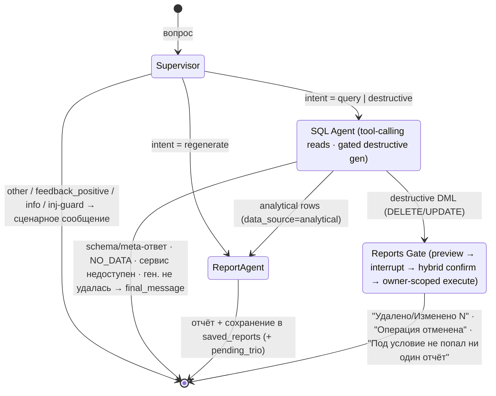
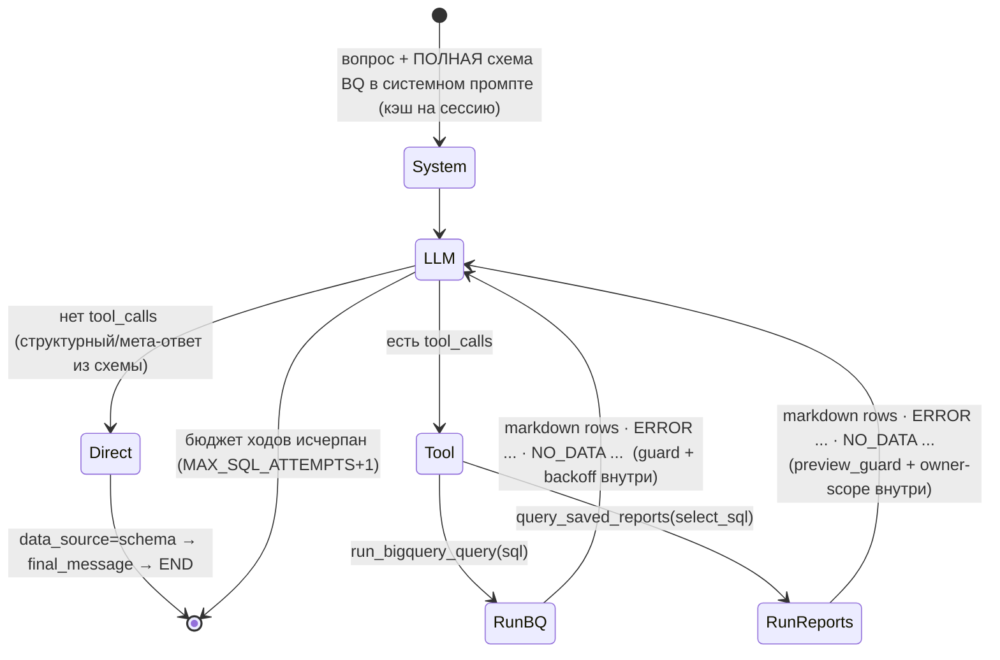

# Prototype: Retail Data Analysis Assistant (реализация)

> Документ описывает **фактически реализованный прототип** и поддерживается в синхроне с кодом.
> Извлечён из [HLD.md](HLD.md): прототип — это «локальный срез» облачной архитектуры (без Cloud Run,
> Cloud SQL, pgvector, async-воркеров и UI).
>
> Стек: **Python 3.11+ · LangGraph · LangChain (`langchain-google-genai`) · Google Gemini
> (2.5-flash-lite / 3.5-flash / 2.5-flash) · BigQuery (read-only) · SQLite · Arize Phoenix
> (опц. трейсинг) · DeepEval (eval-тесты) · CLI**.

---

## 0. Главное за 30 секунд

Чат-агент в CLI. Пользователь задаёт вопрос на естественном языке → граф LangGraph:

1. **Supervisor** (тонкий) классифицирует *поток*: `query` (чтение данных/схемы/библиотеки) ·
   `destructive` (удаление/изменение отчётов) · `regenerate` (правка прошлого отчёта) ·
   `feedback_positive` / `info` / `other` (сразу сценарный ответ).
2. **SQL Agent** для `query` — это **tool-calling агент**: схема BigQuery вшита в системный промпт,
   модель сама выбирает источник, вызывая инструмент (`run_bigquery_query` для аналитики /
   `query_saved_reports` для библиотеки) и пишет SQL как **аргумент** инструмента; на структурный
   вопрос отвечает прямо из схемы без инструмента. Guard'ы — внутри инструментов.
3. **Report Agent** формирует markdown-отчёт по результату и сохраняет его в локальную библиотеку
   (SQLite). `regenerate` правит прошлый отчёт без нового запроса.
4. Для `destructive` SQL-агент генерирует **PREVIEW + ACTION** (DELETE/UPDATE по `saved_reports`);
   **Reports Gate** показывает превью затронутых записей и **требует подтверждения** (`interrupt()`),
   затем исполняет операцию, **принудительно ограничив её владельцем**.
5. Всё устойчиво к ошибкам SQL/пустым ответам/недоступности сервисов — **самокорректируется и не
   падает**, не раздувая стоимость (жёсткие бюджеты регенераций и backoff; Gemini — fail-fast).

LLM-вызовы и узлы графа можно трассировать в **Phoenix** (опционально, флаг `--trace`). **Debug-режим**
(`--debug`) показывает SQL/ошибки/трейсбэки; в обычном режиме пользователь видит **только сценарные
сообщения**.

---

## 1. Scope прототипа

### 1.1 Реализуемые требования (выбраны заказчиком: #2 и #3)

| # | Требование | Статус |
|---|---|---|
| **High-Stakes Oversight (Destructive Ops)** | Библиотека «Saved Reports» + превью → строгое подтверждение (`interrupt()`) перед DELETE/UPDATE, гибридное подтверждение, удаление только своих отчётов | ✅ реализовано |
| **Resilience & Graceful Error Handling** | Самокоррекция SQL, обработка пустых ответов, exp-backoff при недоступности BigQuery, fail-fast на Gemini, REPL не падает, без раздувания стоимости | ✅ реализовано |

### 1.2 Базовая функциональность (обязательна по заданию)

- Чат-агент, **динамически генерирующий и исполняющий SQL** к `bigquery-public-data.thelook_ecommerce`.
- Таблицы **читаются живьём** из датасета (`list_tables()` + `get_table_schema()`), список и колонки
  **не захардкожены**. Основные: `orders`, `order_items`, `products`, `users` (а также
  `inventory_items`, `events`, `distribution_centers`).
- Возможности агента:
  - поведение клиентов (топ-клиенты, суммарные траты);
  - перформанс товаров;
  - метрики по времени (выручка по месяцам, выручка по товарам «на сегодня»);
  - вопросы про **структуру БД** (какие таблицы/колонки/типы) — ответ из вшитой схемы, без обращения к BigQuery;
  - **просмотр библиотеки** сохранённых отчётов (список / поиск / показать).
- Простой **CLI**-интерфейс.
- Запускается на другой машине по инструкции (Docker не обязателен).
- Один из **новых Gemini**-моделей (SQL-агент — `gemini-3.5-flash`).

### 1.3 Дополнительно реализовано (сверх минимального scope)

- **`regenerate`** — правка прошлого отчёта («сделай короче», «в виде списка») без нового запроса
  к BigQuery: предыдущий отчёт и его данные читаются из состояния (сессия делит один thread checkpointer'а).
- **Гибридное подтверждение** деструктива: детерминированный пол «да/нет» + LLM только на неоднозначном
  ответе, со смещением в сторону «не подтверждено».
- **Guard от инъекций на входе** (supervisor): SQL-инъекции (`; DROP`, `--`, `UNION SELECT`),
  prompt-инъекции (EN/RU: «ignore your rules» / «игнорируй правила»), попытки сослаться на чужую
  (BigQuery) таблицу в деструктивном запросе.
- **Отложенный захват троек** (`staged_trios`): тройка `question→sql→report` пишется write-only только
  при положительном сигнале (явная похвала / пользователь спокойно продолжил / AFK после отчёта).
- **`feedback_positive` / `info`** интенты — короткие сценарные ответы без обращения к данным.

### 1.4 Вне scope (НЕ реализовано в прототипе)

- ❌ **Ретривинг Golden Bucket в query-time** — SQL/Report агенты работают на вшитых промптах + схеме БД,
  без few-shot из троек. Таблица `trios` определена в DDL, но не читается/не заполняется.
- ❌ **Evaluator** (LLM-судья, продвижение `staged_trios → trios`). Тройки только захватываются (write-only).
- ❌ **PII-маскирование** (требование #1 не выбрано). ⚠️ **Known limitation:** агент может вернуть
  email/имя/адрес из `users`/`orders`. Осознанное допущение; детерминированный маскер описан в HLD §6.2.
- ❌ Learning Loop как фича (#4): `user_prefs` определяется как таблица и опционально читается Report-агентом
  (`output_format`), но через диалог не управляется; Prefs Extractor (`app/agents/prefs_extractor.py`) —
  заглушка под будущий async-воркер.
- ❌ Persona Management (#8), асинхронные воркеры, Pub/Sub, Cloud-деплой, React UI, аутентификация, стриминг.

### 1.5 Инфраструктура (инструмент, не «закрытое требование»)

- ✅ **Phoenix трейсинг** всех LLM-вызовов и узлов графа — **opt-in** (`--trace` / `TRACING=1`),
  поднятие падает мягко (трейсинг — инфраструктура, не требование).
- ✅ **Debug-режим** показа ошибок (`--debug` / `DEBUG=1`).

---

## 2. Архитектура прототипа

### 2.1 Граф LangGraph (`app/graph/build.py`)



Маршрутизация:
- `supervisor` → conditional: `query|destructive → sql_agent`, `regenerate → report_agent`, `other → END`
  (метки `feedback_positive`/`info`/inj-guard внутри супервайзера сворачиваются в `other` с готовым `final_message`).
- `sql_agent` → conditional (`_route_after_sql`): если выставлен `final_message` → `END`; если
  `intent == destructive` → `reports_gate`; если `data_source == schema` → `END`; иначе → `report_agent`.
- `report_agent`, `reports_gate` → `END`.

**Defense-in-depth:** деструктивный gate срабатывает на **детерминированном глаголе SQL** (`DELETE`/`UPDATE`),
а не на метке супервайзера — мисклассификация не может пропустить удаление мимо подтверждения.

### 2.2 Внутренний цикл SQL Agent для `query` — tool-calling (Resilience)



- **Schema** инжектируется в системный промпт один раз за сессию (`lru_cache` в `app/tools/schema.py`
  + перенос `schema_text` в state), поэтому модели почти никогда не нужен tool `fetch_bq_schema`.
- **Guard'ы внутри инструментов** (детерминированно, до исполнения): `select_only_guard` (только один
  SELECT/WITH; запрет DML/DDL/`;`/комментариев), `preview_guard` (SELECT строго по `saved_reports`).
- **Самокоррекция** — инструмент возвращает строку `ERROR: ...`/`NO_DATA: ...`; модель исправляет SQL и
  вызывает инструмент снова **в пределах бюджета ходов** (`MAX_SQL_ATTEMPTS + 1`). Это и есть защита от
  раздувания стоимости — число LLM-перегенераций жёстко ограничено.
- **Backoff** при недоступности BigQuery — внутри `run_with_backoff` (`1→2→4→8→16s`, ≤ 5 ретраев),
  **независимый бюджет** от регенераций.

Для `destructive` SQL-агент работает не tool-calling-циклом, а как **gated-генератор** (см. §4):
выдаёт две строки `PREVIEW:`/`ACTION:`, валидирует `dml_guard`, перегенерирует при reject (≤ 3).

### 2.3 Карта файлов проекта

```
retail-data-analysis-assistant/
├── main.py                     # точка входа → app.cli:main
├── requirements.txt
├── pytest.ini                  # unit-набор по умолчанию = tests/
├── .env.example
├── README.md                   # краткий запуск + прогон evals
├── Prototype.md / HLD.md / Eval-Dataset.md
└── app/
    ├── config.py               # env, модели, лимиты, бюджеты, пути, validate_required()
    ├── llm.py                  # фабрика ChatGoogleGenerativeAI (lru_cache) + llm_text() нормализация
    ├── retry.py                # retry_with_backoff — переиспользуемый exp-backoff декоратор
    ├── errors.py               # таксономия ошибок, классификаторы BQ/LLM, сценарные сообщения, format_*
    ├── observability.py        # Phoenix init (opt-in, мягкий)
    ├── cli.py                  # REPL, флаги --debug/--trace, resume-цикл подтверждения, AFK троек
    ├── graph/
    │   ├── state.py            # AgentState (TypedDict)
    │   └── build.py            # сборка StateGraph + routers + checkpointer (SqliteSaver)
    ├── agents/                 # узлы графа (промпты живут здесь, рядом с узлом)
    │   ├── supervisor.py       # тонкая классификация intent + input-guard от инъекций + flush троек
    │   ├── sql_agent.py        # tool-calling для чтения · gated-генерация для деструктива
    │   ├── report_agent.py     # генерация отчёта + сохранение · ветка regenerate
    │   ├── reports_gate.py     # preview → interrupt → гибридное подтверждение → owner-scoped execute
    │   └── prefs_extractor.py  # заглушка под будущий async-воркер (NotImplemented)
    ├── tools/                  # детерминированные инструменты — без промптов, без LLM
    │   ├── query_tools.py      # @tool run_bigquery_query / query_saved_reports / fetch_bq_schema
    │   ├── sql_tools.py        # guard'ы (select/preview/dml/reports), run_with_backoff, df_to_markdown
    │   ├── reports.py          # parse PREVIEW/ACTION, make_preview_sql, format_rows
    │   └── schema.py           # интроспекция схемы BQ (lru_cache)
    └── sources/                # доступ к данным
        ├── bigquery.py         # BigQueryRunner (дан заказчиком) + cost-guard + lazy singleton
        ├── db.py               # SQLite DDL/init_db, кэш-коннекшн, get_table_schema_text
        ├── reports_repo.py     # SavedReportsRepo (owner-scoping!), StagedTriosRepo, flush_pending_trio
        └── prefs_repo.py       # UserPrefsRepo.get_output_format
└── evals/                      # DeepEval-набор (см. §13)
└── tests/                      # детерминированный unit-набор (169 тестов, без сети)
```

---

## 3. Компоненты

### 3.1 CLI (`app/cli.py`)

- Простой REPL: читает строку, прогоняет через граф, печатает `final_message`; печатает `[intent: ...]`.
- Команды: обычный текст = вопрос; `exit`/`quit`/`выход` — выход.
- Флаги: `--debug` или `DEBUG=1` — debug-режим (§8); `--trace` или `TRACING=1` — Phoenix-трейсинг (§7.3).
- **Один `thread_id` на всю сессию** (генерируется при старте) — state переживает ходы, что нужно для
  `regenerate` и для `interrupt()/resume()` деструктива. Per-turn управляющие поля чистятся в супервайзере.
- **Confirmation-flow:** при `interrupt()` (деструктив) CLI печатает превью затронутых записей и спрашивает
  подтверждение; ответ пользователя передаётся в `app.invoke(Command(resume=answer), run_config)` —
  возобновляется тот же thread. Запрос подтверждения **блокирующий** (`input()`).
- **AFK после отчёта:** когда есть `pending_trio`, следующий ввод читается с таймаутом
  `TRIO_AFK_TIMEOUT_S` (по умолч. 300 с) — при простое тройка считается «одобренной» и пишется в
  `staged_trios`. *(Константа `AFK_TIMEOUT_S=30` зарезервирована под авто-отмену подтверждения; в текущем
  CLI сам запрос подтверждения блокирующий.)*
- `init_db()` вызывается автоматически на старте — отдельного шага инициализации БД не требуется.
- REPL обёрнут в `try/except`: любая непойманная ошибка превращается в сценарное сообщение, цикл живёт (§5.4).

### 3.2 Supervisor (`app/agents/supervisor.py`)

- Модель: **`gemini-2.5-flash-lite`** (быстрая классификация).
- **Тонкий**: решает только *поток*. Источник данных для `query` (analytical / schema / reports) выбирает
  ниже сам SQL-агент.
- Метки: `query` · `destructive` · `regenerate` · `feedback_positive` · `info` · `other`.
  `feedback_positive` («спасибо», «отлично») и `info` («к каким данным у тебя доступ») сворачиваются в
  `other`-маршрут с готовым сообщением.
- **Input-guard от инъекций** (`_INJECTION_RE`, только при `intent == destructive`): SQL-инъекции,
  prompt-инъекции (EN/RU), ссылки на защищённые BigQuery-таблицы → отказ с предупреждением, SQL-агент не вызывается.
- **Flush троек**: `pending_trio` из прошлого хода → `regenerate` отбрасывает (правка ≠ одобрение),
  `feedback_positive` и любой другой интент → пишут тройку в `staged_trios`.
- Строгий вывод: одно слово из множества; при нераспознанном — `other`. Ошибка LLM → `other` + сценарное.

### 3.3 SQL Agent (`app/agents/sql_agent.py`)

- Модель: **`gemini-3.5-flash`** (новейшая; `llm_text()` нормализует content-блоки Gemini 3.x).
- **Чтение (`query`)** — tool-calling цикл (§2.2): bind `[run_bigquery_query, query_saved_reports]`,
  схема в системном промпте, цикл до `MAX_SQL_ATTEMPTS + 1` ходов. Приоритет исхода:
  успешные данные > данные с ошибкой (`NO_DATA`/недоступность/`SQL_GEN_FAILED`) > прямой ответ
  (структурный, `data_source=schema`) > ничего. Источник определяется выбранным инструментом
  (`SOURCE_BY_TOOL`) и кладётся в `data_source`.
- **Деструктив (`destructive`)** — gated-генерация (§4): два-строчный вывод `PREVIEW:`/`ACTION:` →
  `parse_reports_output` → `dml_guard`; reject → перегенерация с hint'ом (≤ 3). Исполнение здесь **не делается**.
- Диалект BigQuery: Standard SQL, полные имена `` `bigquery-public-data.thelook_ecommerce.<table>` ``.
  Исполнение — через `BigQueryRunner.execute_query()` с cost-guard `maximum_bytes_billed` (§7.1).
- DataFrame → компактная markdown-таблица (`df_to_markdown`), обрезается до `LLM_ROWS_LIMIT` (100) строк.

### 3.4 Report Agent (`app/agents/report_agent.py`)

- Модель: **`gemini-2.5-flash`** (temperature 0.3).
- **Normal:** вход = вопрос + результат SQL (`rows_markdown`). Выход — markdown-отчёт: подписи колонок,
  единицы (валюта для revenue/amount/price, счётчики для qty, `%` для процентов), нумерация для топ-N.
  По умолчанию язык — английский; переключается на язык вопроса. Формат читается из `user_prefs.output_format`
  (по умолчанию `table`).
- **Regenerate:** правит прошлый отчёт под коррекцию пользователя; числа — только из сохранённых `rows_markdown`,
  нового запроса нет. Оригинальный вопрос берётся из `last_question`.
- После генерации — **сохранение** в `saved_reports` (`SavedReportsRepo.save`), к ответу добавляется пометка
  `_(отчёт сохранён в библиотеку)_`. Данные тройки кладутся в `pending_trio` (отложенный захват, см. §3.2).

### 3.5 Reports Gate (`app/agents/reports_gate.py`)

Ядро High-Stakes Oversight — см. §4.

### 3.6 Инструменты (`app/tools/`)

- `query_tools.py` — `@tool`-функции, которые SQL-агент биндит к LLM. Детерминированные, guard до исполнения,
  возвращают строку (`ERROR:`/`NO_DATA:` модель читает и исправляется). `fetch_bq_schema` существует, но
  **не биндится** (схема и так в промпте).
- `sql_tools.py` — guard'ы (`select_only_guard`, `preview_guard`, `dml_guard`, `reports_sql_guard`),
  `run_with_backoff` (exp-backoff поверх `BigQueryRunner`), `df_to_markdown`, `strip_sql`.
- `reports.py` — `parse_reports_output` (PREVIEW/ACTION), `make_preview_sql` (fallback-превью из DML),
  `format_rows` (markdown библиотеки).
- `schema.py` — `get_bq_tables` / `get_schema_text` (живая интроспекция, `lru_cache`).

### 3.7 Хранилище SQLite (`app/sources/`)

- Один файл БД (`DB_PATH`, по умолчанию `agentic.db`). `init_db()` — idempotent `CREATE TABLE IF NOT EXISTS` (§10).
- **LangGraph checkpointer** — `SqliteSaver` на отдельном файле `checkpoints.db` (нужен для `interrupt()/resume()`).
- Репозитории инкапсулируют доступ; критическое свойство безопасности — **`SavedReportsRepo` всегда инжектит
  `owner_id` в коде** (`preview` / `run_select` / `execute_destructive`), никогда не из LLM (§4).
- `StagedTriosRepo` — write-only захват троек. `UserPrefsRepo` — опциональное чтение `output_format`.

---

## 4. Требование #2 — High-Stakes Oversight (Destructive Ops)

**Задача:** «Удали все мои отчёты за сегодня» / «Удали отчёты про клиента X» / «Переименуй отчёт …» с
обязательным подтверждением, пользователь затрагивает **только свои** отчёты, UX не ломается.

### 4.1 Поток

```
Пользователь: "Удали все мои отчёты за сегодня"

→ [Supervisor] intent = destructive  (+ input-guard от инъекций; при срабатывании — отказ на входе)

→ [SQL Agent · destructive] два артефакта (вывод PREVIEW:/ACTION:):
   PREVIEW: SELECT id, question, created_at FROM saved_reports WHERE date(created_at) = date('now')
   ACTION:  DELETE FROM saved_reports WHERE date(created_at) = date('now')
   (UPDATE — для переименования/изменения; SET только question | report_md | published_to_golden)

→ [dml_guard] детерминированно (НЕ LLM):
   ├─ ровно один statement ∈ {DELETE, UPDATE}?               иначе reject
   ├─ целевая таблица == saved_reports?                      иначе reject
   ├─ нет DDL/INSERT/MERGE/`;`/комментариев?                 иначе reject
   └─ reject → перегенерация (attempt < 3) → иначе REPORTS_GEN_FAILED

→ [Reports Gate]
   ├─ preview_sql (от агента, если прошёл preview_guard; иначе derive из DML) → preview_guard
   ├─ SavedReportsRepo.preview(preview_sql, owner_id)   ← owner_id инжектится в коде
   ├─ пусто (0 строк) → "Под условие не попал ни один отчёт"  (НЕ уходим в interrupt)
   ├─ interrupt({verb, count, preview_rows, dml_sql}) — граф заморожен, ждёт ответа
   └─ resume:
       DELETE → _is_confirmed(answer): гибридное (да/нет пол + LLM на неоднозначном, biased to NO)
       UPDATE → _parse_pick(answer): cancel | all | номер (можно сузить UPDATE до одной строки)

→ "нет"/cancel → "Операция отменена"
→ "да"/all/номер → SavedReportsRepo.execute_destructive(dml, owner_id)
                   → репозиторий ПРИНУДИТЕЛЬНО добавляет "AND owner_id = ?" → "✓ Удалено/Изменено N"
```

### 4.2 Два независимых рубежа защиты

1. **`dml_guard`** ограничивает *тип и цель*: только `DELETE`/`UPDATE`, только по `saved_reports`,
   без DDL/множественных стейтментов/комментариев.
2. **Репозиторий** ограничивает *область*: всегда добавляет `AND owner_id = ?`. `owner_id` берётся из
   конфига (`CURRENT_USER_ID`), **никогда** из LLM. Даже при удачной prompt-инъекции чужие отчёты недостижимы.

Плюс **третий рубеж на входе** — supervisor режет явные инъекции до SQL-агента, и **четвёртый**: gate
срабатывает на детерминированном глаголе SQL, а не на метке супервайзера.

### 4.3 Детали реализации

- `CURRENT_USER_ID` — из env `CURRENT_USER` (по умолчанию `default_user`). Прототип однопользовательский,
  но owner-scoping обязателен.
- Превью обязательно показывает, **что именно** будет затронуто (id/вопрос/время) и число записей.
- Пустое превью (0 записей) — `PREVIEW_EMPTY`, без `interrupt()`.
- Гибридное подтверждение: явные «да»/«нет» обрабатываются детерминированно; всё неоднозначное идёт в LLM,
  смещённый к «не подтверждено» (ошибка/недоступность LLM → не подтверждено — никогда не удаляем на сомнении).
- «за сегодня» → `date(created_at) = date('now')` (диалект SQLite).
- ⚠️ **Known gap (отложено):** `_inject_owner_scope` дописывает предикат конкатенацией строки — без скобок
  вокруг существующего `WHERE` и без учёта хвостового `ORDER BY/LIMIT`. На SQL с `OR` в `WHERE` это может
  ослабить scoping. Зафиксировано в docstring `reports_repo.py` и закреплено xfail-тестами (memory:
  `owner-scope-security-gap`). Для прототипа (однопользовательский, guard режет `OR`-побочку лишь частично)
  — приемлемо; на исправление — параметризованный rewrite WHERE.

---

## 5. Требование #3 — Resilience & Graceful Error Handling

### 5.1 Guards (детерминированные, `app/tools/sql_tools.py`)

- **`select_only_guard`** (BigQuery): нормализует SQL, требует единственный `SELECT`/`WITH ... SELECT`;
  запрещает `INSERT/UPDATE/DELETE/DROP/ALTER/CREATE/TRUNCATE/MERGE/...`, `;` и комментарии. Reject → инструмент
  возвращает `ERROR:` → перегенерация.
- **`preview_guard`** — SELECT строго по `saved_reports` (превью деструктива и чтение библиотеки).
- **`dml_guard`** — ровно один `DELETE`/`UPDATE` по `saved_reports`, без DDL/`;`/комментариев (см. §4).

### 5.2 Retry / self-correction политика

| Ситуация | Поведение | Лимит |
|---|---|---|
| SQL не прошёл guard / синтаксис / неверная колонка | инструмент → `ERROR: ...`; модель чинит SQL и зовёт инструмент снова | ходов ≤ `MAX_SQL_ATTEMPTS+1` |
| Запрос вернул 0 строк | инструмент → `NO_DATA: ...`; модель может **один раз** расширить фильтры (мягко, в рамках бюджета ходов) | в рамках бюджета |
| Исчерпан бюджет ходов SQL | сценарное: «Не удалось сформировать запрос, переформулируйте вопрос» (`SQL_GEN_FAILED`) | — |
| Результат всё ещё пуст | сценарное: «По вашему запросу данных нет» (`NO_DATA`) | — |
| BigQuery недоступен (5xx/timeout/connection) | exponential backoff `1→2→4→8→16s` в `run_with_backoff` | retry ≤ 5 |
| Backoff исчерпан | сценарное: «Сервис временно недоступен, попробуйте позже» (`SERVICE_UNAVAILABLE`) | — |
| Gemini 429 / quota / overload | **без ретраев** (`LLM_MAX_RETRIES=1`), сразу `LLM_UNAVAILABLE` | 1 |
| Gemini 5xx / транзиентная недоступность | **без app-ретраев** (fail-fast), `SERVICE_UNAVAILABLE` | 1 |
| Деструктив: `dml_guard` reject | перегенерация с указанием причины | attempt ≤ 3 |
| Деструктив: бюджет исчерпан | сценарное: `REPORTS_GEN_FAILED` | — |
| SQLite «database is locked» / not ready | backoff (тот же декоратор, `is_retryable_sqlite`) | retry ≤ 5 |
| Любая неожиданная ошибка | поймать, сценарное `UNEXPECTED`; в debug — трейсбэк | — |

### 5.3 Анти-инфляция стоимости

- Жёсткие бюджеты: регенерации ≤ 3, backoff ≤ 5 — модель не зацикливается.
- `maximum_bytes_billed` на каждый BigQuery-запрос (§7.1) + дефолтный `LIMIT` для row-listing (через промпт);
  для агрегатов LIMIT не навязывается (исказил бы результат) — защита здесь `maximum_bytes_billed`.
- Gemini — fail-fast: `LLM_MAX_RETRIES=1` отключает встроенный SDK-ретрай (иначе до ~4 мин backoff на 5xx/429),
  `LLM_TIMEOUT_S=60` ограничивает зависший запрос. Ретраи 429 только жгли бы квоту.

### 5.4 UI не падает

- Весь прогон графа в CLI обёрнут в `try/except`; любое исключение → сценарное сообщение, REPL продолжает работу.
- Узлы графа сами ловят ошибки и возвращают `final_message` (классификаторы из `errors.py` выбирают нужное
  сценарное сообщение). Стектрейс — только в debug-режиме.

---

## 6. Промпты

> Все промпты **захардкожены в коде и живут рядом со своим узлом** (`app/agents/*.py`), а не в отдельном
> `prompts.py` — узел владеет своим промптом, инструменты (`app/tools/*`) промптов не содержат. Просим модель
> отвечать на языке вопроса (Report Agent — англ. по умолчанию, переключается на язык вопроса).

| Промпт | Где | Назначение |
|---|---|---|
| `_SUPERVISOR_PROMPT` | `agents/supervisor.py` | классификация в одну метку из 6; строгий one-word вывод |
| `_QUERY_SYSTEM_TPL` | `agents/sql_agent.py` | системный промпт tool-calling: вшитая схема BQ + выбор источника/инструмента |
| `_DESTRUCTIVE_PROMPT` + `_GUARD_HINT` | `agents/sql_agent.py` | генерация `PREVIEW:`/`ACTION:`, перегенерация при reject |
| `_REPORT_PROMPT` / `_REVISION_PROMPT` | `agents/report_agent.py` | отчёт по данным / правка прошлого отчёта |
| `_CONFIRM_PROMPT` / `_PICK_PROMPT` | `agents/reports_gate.py` | LLM-резолв неоднозначного подтверждения / выбор строки для UPDATE |
| `_INFO_RESPONSE` / `OTHER_INTENT` / сценарные | `agents/supervisor.py`, `errors.py` | фиксированные ответы (не LLM) |

Пример — системный промпт чтения (сокр.):

```
You are a data analyst for a retail analytics assistant. Answer by calling the available tools —
choose the data source yourself:
BigQuery schema (full — write correct SQL, no schema tool call needed):
{schema_text}
- Warehouse values → ONE BigQuery Standard SQL SELECT, call run_bigquery_query.
- DB STRUCTURE question → answer directly from the schema above (no tool call). If a table is absent, say so.
- SAVED REPORTS library → ONE SQLite SELECT on saved_reports, call query_saved_reports.
Rules: never DML/DDL here; never answer from assumptions; on 'ERROR:' fix SQL and retry; on 'NO_DATA:'
broaden filters once; stop as soon as you have the data.
```

Пример — деструктивная генерация (сокр.):

```
You write a destructive SQLite statement against the user's saved-reports library.
Schema (live): {schema}
Rules: DELETE or UPDATE on saved_reports only; NEVER reference owner_id (enforced in code);
"today" → date(created_at) = date('now'); search by topic → question LIKE '%term%' OR report_md LIKE '%term%'.
Output EXACTLY TWO lines:
PREVIEW: SELECT id, question, created_at FROM saved_reports WHERE <condition>
ACTION:  <DELETE FROM saved_reports WHERE <condition> | UPDATE saved_reports SET ... WHERE <condition>>
The PREVIEW must select the EXACT same rows the ACTION affects.
```

---

## 7. Внешние интеграции

### 7.1 BigQuery (`app/sources/bigquery.py`) — дан заказчиком

Класс `BigQueryRunner` используется как есть (`execute_query`, `get_table_schema`), плюс **обязательное
расширение** — cost-guard `QueryJobConfig(maximum_bytes_billed=BQ_MAX_BYTES_BILLED)` и метод `list_tables()`
(живой список таблиц). Создаётся лениво через `get_bq_runner()` (`lru_cache`).

> Различение исключений `google.api_core.exceptions` → политика §5.2 в `errors.py`: **retryable**
> (5xx/timeout — backoff) vs **query** (4xx/синтаксис/нет колонки — перегенерация SQL) vs **forbidden**
> (permissions/billing — не ретраим, `UNEXPECTED`).

### 7.2 LLM — Google Gemini (`app/llm.py`, через `langchain-google-genai`)

- `ChatGoogleGenerativeAI(model=..., temperature=..., max_retries=1, timeout=60)`, ключ из `GOOGLE_API_KEY`.
  Клиент кэшируется (`lru_cache`) на `(model, temperature)`. `llm_text()` нормализует ответ (строка или
  content-блоки Gemini 3.x).

| Агент | Модель (env, дефолт) |
|---|---|
| Supervisor / confirm-residual / pick | `SUPERVISOR_MODEL` = `gemini-2.5-flash-lite` |
| SQL Agent | `SQL_MODEL` = `gemini-3.5-flash` |
| Report Agent | `REPORT_MODEL` = `gemini-2.5-flash` |

### 7.3 Трейсинг — Arize Phoenix (`app/observability.py`) — opt-in

- Включается `--trace` / `TRACING=1`. Инициализируется **до** сборки графа; ошибки **не фатальны**.
- Эмбеддед-UI (`px.launch_app()` → `http://localhost:6006`) или внешний коллектор
  (`PHOENIX_COLLECTOR_ENDPOINT`, чтобы трейсы сохранялись между прогонами). Инструментируется
  LangChain/LangGraph через OpenInference.
- В трейсах видны узлы графа и все LLM-вызовы (вход/выход/латентность) — источник данных для debug-режима.

---

## 8. Debug-режим

- Включается `--debug` / `DEBUG=1`.
- **Обычный режим:** пользователь видит **только сценарные сообщения** (§5.2 / §4) — без трейсбэков/SQL.
- **Debug-режим:** дополнительно печатается сгенерированный SQL/DML, текст ошибки, причина reject guard'а,
  трейсбэк пойманного исключения и ссылка на Phoenix (`http://localhost:6006`).
- Реализация: хелперы `format_error` / `format_llm_error` в `errors.py` смотрят на флаг `debug` из state.

---

## 9. Запуск на другой машине

### 9.1 Предварительные требования

- Python **3.11+**.
- GCP-проект для **биллинга BigQuery** (публичный датасет тарифицируется на ваш проект). ADC:
  `gcloud auth application-default login` **или** `GOOGLE_APPLICATION_CREDENTIALS=/path/to/sa.json`
  (роль `roles/bigquery.user`/`dataViewer`).
- **`GOOGLE_API_KEY`** — ключ Gemini (AI Studio). Оба (`GOOGLE_API_KEY`, `GCP_PROJECT`) проверяются на старте.

### 9.2 requirements.txt

```
# дано заказчиком
langgraph>=0.2.0
langchain-google-genai>=1.0.0
google-cloud-bigquery>=3.13.0
pandas>=2.0.0
python-dotenv>=1.0.0
langchain_core>=0.3.0
db-dtypes==1.2.0

# добавлено для прототипа
langchain>=0.3.0
langgraph-checkpoint-sqlite>=2.0.0     # SqliteSaver: interrupt()/resume()
arize-phoenix>=4.0.0                    # локальный трейсинг + UI (opt-in)
arize-phoenix-otel>=0.6.0
openinference-instrumentation-langchain>=0.1.0

# автотесты тест-плана (evals/)
deepeval>=4.0.0                         # прогон + LLM-судьи (Gemini)
pytest>=8.0.0
```

> SQLite — из стандартной библиотеки (`sqlite3`).

### 9.3 Переменные окружения (`.env.example`)

```
# Обязательные (fail-fast на старте)
GOOGLE_API_KEY=your-gemini-api-key
GCP_PROJECT=your-gcp-project-id

# BigQuery auth (опц., если не gcloud ADC)
# GOOGLE_APPLICATION_CREDENTIALS=/path/to/service-account.json

# Модели (дефолты показаны)
SUPERVISOR_MODEL=gemini-2.5-flash-lite
SQL_MODEL=gemini-3.5-flash
REPORT_MODEL=gemini-2.5-flash

# Guardrails / устойчивость
DEFAULT_LIMIT=100
MAX_BYTES_BILLED=1073741824            # 1 GiB cost-guard на запрос
RETRY_ATTEMPTS=3                       # бюджет регенерации SQL
AFK_TIMEOUT_S=30                       # резерв под авто-отмену подтверждения
LLM_TIMEOUT_S=60                       # таймаут одного Gemini-запроса (SDK-ретраи выключены)

# Локальное хранилище / личность
DB_PATH=agentic.db
CURRENT_USER=default_user

# Verbosity (= --debug) и трейсинг (= --trace)
DEBUG=
TRACING=
# PHOENIX_COLLECTOR_ENDPOINT=http://localhost:6006   # внешний коллектор вместо эмбеддед
```

> Внутренние дефолты (не в `.env`): `CHECKPOINTS_PATH=checkpoints.db`, `TRIO_AFK_TIMEOUT_S=300`,
> backoff `1→2→4→8→16` (≤5), `LLM_MAX_RETRIES=1`.

### 9.4 Шаги

```bash
git clone <repo> && cd retail-data-analysis-assistant
git checkout implementation

python -m venv .venv && source .venv/bin/activate     # Windows: .venv\Scripts\activate
pip install -r requirements.txt

cp .env.example .env        # заполнить GOOGLE_API_KEY, GCP_PROJECT
gcloud auth application-default login    # если не используете SA json

python main.py              # запуск CLI (init_db() выполняется автоматически)
python main.py --debug      # ошибки/трейсбэки
python main.py --trace      # Phoenix на http://localhost:6006
```

---

## 10. SQLite DDL (`app/sources/db.py`)

> Активно используется: **`saved_reports`**. Write-only: **`staged_trios`**. Определены для полноты схемы,
> но в активном потоке не читаются/не заполняются: **`trios`** (Golden Bucket — вне scope), **`user_prefs`**
> (опциональное чтение `output_format`). Чекпоинты LangGraph создаёт `SqliteSaver` сам в `checkpoints.db`.

```sql
CREATE TABLE IF NOT EXISTS saved_reports (
    id                  TEXT PRIMARY KEY,
    owner_id            TEXT NOT NULL,
    question            TEXT NOT NULL,
    sql_query           TEXT NOT NULL,
    report_md           TEXT NOT NULL,
    created_at          TEXT NOT NULL DEFAULT (datetime('now')),
    published_to_golden INTEGER NOT NULL DEFAULT 0
);
CREATE INDEX IF NOT EXISTS idx_saved_reports_owner   ON saved_reports(owner_id);
CREATE INDEX IF NOT EXISTS idx_saved_reports_created ON saved_reports(created_at);

CREATE TABLE IF NOT EXISTS staged_trios (
    id          TEXT PRIMARY KEY,
    report_id   TEXT NOT NULL,
    owner_id    TEXT NOT NULL,
    question    TEXT NOT NULL,
    sql_query   TEXT NOT NULL,
    report_md   TEXT NOT NULL,
    status      TEXT NOT NULL DEFAULT 'pending',
    created_at  TEXT NOT NULL DEFAULT (datetime('now'))
);

CREATE TABLE IF NOT EXISTS trios (
    id                 TEXT PRIMARY KEY,
    question           TEXT NOT NULL,
    sql_query          TEXT NOT NULL,
    report_md          TEXT NOT NULL,
    embedding          BLOB,
    faithfulness_score REAL,
    relevancy_score    REAL,
    format_score       REAL,
    usage_count        INTEGER NOT NULL DEFAULT 0,
    created_at         TEXT NOT NULL DEFAULT (datetime('now'))
);

CREATE TABLE IF NOT EXISTS user_prefs (
    user_id         TEXT PRIMARY KEY,
    output_format   TEXT NOT NULL DEFAULT 'table',
    tone_preference TEXT,
    extra_prefs     TEXT,
    updated_at      TEXT NOT NULL DEFAULT (datetime('now'))
);
```

---

## 11. AgentState (`app/graph/state.py`)

```python
class AgentState(TypedDict, total=False):
    question: str
    user_id: str
    debug: bool
    intent: Literal["query", "destructive", "regenerate", "other"]

    # SQL agent
    schema_text: str            # вшитая схема BQ (кэш на сессию)
    sql: str
    sql_attempts: int
    last_error: Optional[str]
    rows_markdown: Optional[str]
    df_row_count: int
    data_source: Optional[str]  # analytical | schema | reports — выбран SQL-агентом

    # report
    report_md: Optional[str]
    last_question: Optional[str]  # для regenerate (общий thread)

    # reports gate (DML confirmation)
    preview_sql: Optional[str]
    preview_rows: Optional[List[dict]]
    confirmed: Optional[bool]

    # отложенный захват тройки (set report_agent → flush supervisor/CLI)
    pending_trio: Optional[dict]

    final_message: str
```

---

## 12. Пример CLI-сессии

```
$ python main.py
Retail Analysis Assistant. Введите вопрос ('exit' для выхода).

> Покажи топ-5 клиентов по суммарным тратам
[intent: query]
📊 Топ-5 клиентов по тратам
| # | Клиент | Сумма трат |
| ... |
_(отчёт сохранён в библиотеку)_

> сделай в виде маркированного списка
[intent: regenerate]
• ... — ...
_(отчёт сохранён в библиотеку)_

> Какие таблицы есть в базе и какие колонки в orders?
[intent: query]
Доступны: orders, order_items, products, users, inventory_items, events, distribution_centers.
Колонки orders: order_id, user_id, status, created_at, ...

> покажи мои сохранённые отчёты
[intent: query]
| id | question | created_at |
| ... |

> Удали все мои отчёты за сегодня
[intent: destructive]
⚠️  Под условие попали записи (удаления): 2
  1. "Топ-5 клиентов по суммарным тратам" (2026-06-30 14:32)
  2. "Выручка по месяцам" (2026-06-30 14:40)
Подтвердить удаление? (да/нет): да
✓ Удалено записей: 2.

> Удали все отчёты Васи
[intent: destructive]
Под условие не попал ни один отчёт.

> Покажи выручку за 1999 год
[intent: query]
По вашему запросу данных нет.

> Какая погода в Москве?
[intent: other]
Я ассистент по аналитике ритейла. Спросите про клиентов, товары, заказы, выручку или структуру базы
данных — либо управляйте сохранёнными отчётами (посмотреть, найти, удалить).

> exit
До свидания!
```

В **debug-режиме** дополнительно печатаются сгенерированный SQL/DML, текст ошибки BigQuery, причина reject
guard'а, трейсбэк и ссылка на Phoenix-трейс.

---

## 13. Тесты

Два независимых набора.

### 13.1 Unit-набор (`tests/`, ~169 тестов) — по умолчанию

Детерминированные, **без сети/LLM/BigQuery** (`pytest.ini` → `testpaths = tests`). Покрывают:
guard'ы (`select/preview/dml`), owner-scoping и репозитории, backoff/классификацию ошибок, роутеры графа,
узлы (supervisor/sql_agent/report_agent/reports_gate), CLI-хелперы, config, init_db, tracing-init.
**Owner-scope gap** закреплён xfail-тестами (memory: `owner-scope-security-gap`).

```bash
pytest                 # весь unit-набор
```

### 13.2 Eval-набор (`evals/`) — DeepEval, opt-in

Прогоняет **настоящий граф** и проверяет его метриками DeepEval. Источник кейсов — золотой набор
[Eval-Dataset.md](Eval-Dataset.md) (+ машиночитаемый `evals/dataset.jsonl`).

**Структура пакета:**
- `harness.py` — драйвер `drive(question, confirm=...)` гоняет вопрос через скомпилированный граф
  (включая interrupt/resume) на **изолированной** временной SQLite-библиотеке; плюс fault-injection
  (`fake_llms`, `fake_bq`, `no_sleep`) для offline-кейсов; `seed_report` для подготовки деструктива.
- `metrics.py` — **детерминированные** `BaseMetric` (читают структурный `RunResult`: intent/data_source,
  превью, owner-scoping, бюджеты, backoff-последовательность) + **LLM-судьи** `GEval` на Gemini
  (Language Match, Analytical Relevance) — той же `GOOGLE_API_KEY`, без OpenAI.
- `cases.py` — кейсы как данные: **live** (реальные Gemini+BigQuery; авто-skip без кредов) и **faults**
  (скриптованные доплеры, offline, детерминированно). `MANUAL_ONLY` — что оставлено на ручную проверку.
- `test_assistant.py` — параметризованный pytest (`assert_test`); `run.py` — runner со сводной таблицей
  PASS/FAIL и CI-кодом возврата; `conftest.py` держит DeepEval локальным (без телеметрии).

**Что покрывают кейсы:**

| Группа | Кейсы | Тип | Проверяет |
|---|---|---|---|
| A — аналитика | A1, A5 | live | intent `query`/`analytical`, число строк, отчёт сохранён, язык, релевантность |
| B — структура БД | B1, B2 | live | `data_source=schema`, реальные таблицы/колонки, без обращения к BigQuery |
| C — Oversight | C1–C4, C6 | live | превью→подтверждение→удаление, отмена, пустое превью, точечность, owner-scoping |
| C-guard | C7, C8, C9, C10 | fault | `dml_guard` режет `;DROP`/чужую таблицу; input-guard режет инъекции на входе |
| D — Resilience | D1, D2 | live | `NO_DATA`; распознавание отсутствующей таблицы (`super_sales`) |
| D — Resilience | D4, D5, D6 | fault | backoff `1→2→4→8→16` к BigQuery; Gemini 429 без ретраев; исключение в узле — graceful |
| E — роутинг | E1, E2 | live | off-topic/приветствие → `other`, без обращения к данным |

**Запуск:**

```bash
python -m evals.run                  # все (live skip без кредов)
python -m evals.run --subset faults  # offline fault-кейсы (без кредов, без затрат)
python -m evals.run --subset live    # только live (нужны GOOGLE_API_KEY/GCP_PROJECT + ADC)
pytest evals/                        # через pytest
deepeval test run evals/test_assistant.py
```

**Известные сигналы (memory: `evals-findings`):**
- **D1** — если модель напишет агрегат `SUM(...)` вместо детального запроса, на «выручку за 1999» вернётся
  1 строка `NULL` (а не 0 строк), ветка «пусто → ревизия» не сработает; эталон ждёт `NO_DATA` — расхождение
  фиксируется как риск (лечится ужесточением промпта).
- **Live-набор** чувствителен к квоте Gemini free-tier — гонять подмножествами (`-k "A1 or B1 or C1"`).
  Offline-набор (`--subset faults`) стабильно зелёный без кредов.

---

## 14. Критерии готовности (acceptance)

1. CLI запускается по §9 на чистой машине; `init_db()` автоматически создаёт все таблицы из §10.
2. Аналитический вопрос → агент генерирует **валидный BigQuery SELECT**, исполняет, возвращает markdown-отчёт,
   сохраняет его в `saved_reports`.
3. Вопрос про структуру БД отвечается из вшитой схемы (`data_source=schema`), без обращения к BigQuery.
4. Просмотр библиотеки («покажи мои отчёты») работает через `query_saved_reports` (owner-scoped).
5. **Resilience:** кривой SQL → самокоррекция (бюджет ходов), затем сценарное; пустой результат → `NO_DATA`;
   недоступность BigQuery → backoff (≤5) → `SERVICE_UNAVAILABLE`; Gemini 429/5xx → fail-fast; REPL не падает.
6. **High-Stakes Oversight:** «удали … за сегодня»/«про X» → превью → `interrupt()` → подтверждение → удаление;
   «нет» отменяет; пустое превью не уходит в подтверждение; `dml_guard` режет не-DELETE/UPDATE и чужие таблицы;
   репозиторий всегда инжектит `owner_id`; инъекции режутся на входе.
7. Все LLM-вызовы и узлы графа видны в Phoenix (при `--trace`).
8. Debug-режим показывает SQL/ошибки/трейсбэки; обычный режим — только сценарные сообщения.
9. Промпты захардкожены в коде рядом с узлами (`app/agents/*.py`).
10. Unit-набор (`pytest`) зелёный; offline eval-набор (`python -m evals.run --subset faults`) зелёный.

---

## 15. Соответствие исходным требованиям (трассировка + проверка)

### 15.1 Обязательные требования задания

| Требование задания | Статус | Где в прототипе |
|---|---|---|
| **1.** Working prototype: chat-агент, динамический SQL к БД, создание отчёта; **поддержать 2 из** {#2 High-Stakes Oversight, #3 Resilience} | ✅ оба #2 и #3 | §3.3 (SQL), §3.4 (Report), §4 (#2), §5 (#3) |
| **2.** Простой **CLI**-интерфейс (UI не нужен) | ✅ | §3.1, `app/cli.py` |
| **3.** Запускается на другой машине (Docker не обязателен, нужны инструкции) | ✅ | §9, `README.md`, `.env.example`, `requirements.txt` |
| **4.** Фреймворк по выбору (предпочтительно LangGraph / LangChain) | ✅ LangGraph + `langchain-google-genai` | §2.1, §7.2 |
| Простота и работоспособность | ✅ | минимальный стек, локальный SQLite, без облака |

### 15.2 Ожидаемые возможности агента

| Возможность | Статус | Где |
|---|---|---|
| Customer behavior (топ-клиенты, суммарные траты) | ✅ | Eval A1–A6, §3.3 |
| Product performance | ✅ | Eval B1–B5 |
| Time-based metrics (выручка по месяцам, актуальная по товарам) | ✅ | Eval C1–C5 |
| Вопросы про структуру БД | ✅ | Eval D1–D4, `data_source=schema` |
| BigQuery-интеграция, **динамическая** генерация и исполнение SQL | ✅ | §3.3, §7.1, `tools/query_tools.py` |
| Новая модель Gemini | ✅ | SQL — `gemini-3.5-flash`; см. §7.2 |

### 15.3 Выбранные требования (#2, #3) и инфраструктура

| Источник | Статус | Где |
|---|---|---|
| #2 High-Stakes Oversight | ✅ | §4, §10 (`saved_reports`), Eval C1–C10 |
| #3 Resilience & Graceful Error Handling | ✅ | §2.2, §5, Eval D1/D2/D4/D5/D6 |
| Трейсинг (Phoenix) + debug-режим | ✅ (трейсинг opt-in) | §7.3, §8 |
| Хардкод-промптов | ✅ (рядом с узлами) | §6 |
| SQLite + DDL | ✅ | §10 |
| Eval/Unit-тесты | ✅ | §13 |
| Вне scope: Golden Bucket retrieval, Evaluator, PII, Learning Loop, Persona | — | §1.4 |

### 15.4 Вердикт

Прототип **полностью покрывает обязательную часть задания** (чат-агент с динамическим BigQuery-SQL,
создание отчётов, CLI, воспроизводимый запуск, LangGraph + новый Gemini) и **оба выбранных требования**
(#2 High-Stakes Oversight с превью/подтверждением/owner-scoping и многослойной защитой; #3 Resilience с
двумя независимыми бюджетами, fail-fast LLM и неубиваемым REPL). Сверх минимума добавлены просмотр
библиотеки, правка отчётов (`regenerate`), input-guard от инъекций, гибридное подтверждение и набор
eval/unit-тестов. Открытый технический долг — owner-scope string-concat gap (§4.3), зафиксирован xfail-тестами.
```
